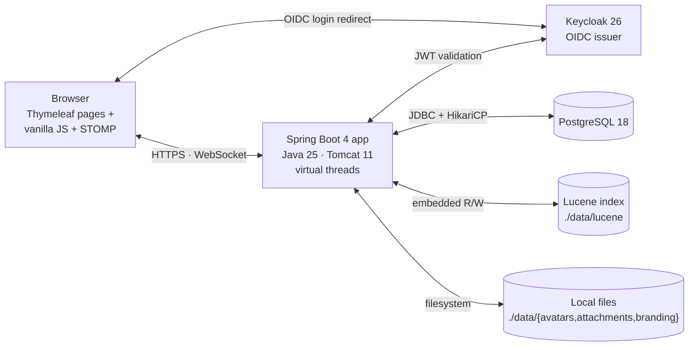
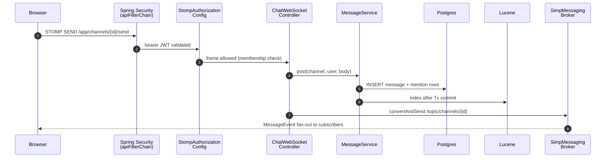
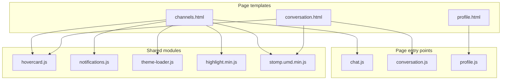

# IntelliStream Chat — self-hosted team chat, built to last

Slack/Mattermost-style workspace chat: channels, threads, direct and group messages, reactions,
mentions, presence, polls, slash commands, full-text search, streamed file uploads, 1:1 voice and
video calls, and OIDC single sign-on. One JVM process, one Postgres database, one systemd unit.

**[intellistream-datahub.github.io/intellistream-chat](https://intellistream-datahub.github.io/intellistream-chat/)** — screenshots, feature tour and the full manual.

<a href="https://intellistream-datahub.github.io/intellistream-chat/">
  <picture>
    <source media="(prefers-color-scheme: dark)" srcset="docs/shots/hero-dark.webp">
    <!-- width only, no height: GitHub's markdown CSS caps images at max-width:100% without
         setting height:auto, so a height attribute stays pinned while the width shrinks to the
         ~880px README column — which renders this 1200x733 shot 195px too tall. -->
    
  </picture>
</a>

Built on Java 25, Spring Boot 4, PostgreSQL 18, Keycloak and embedded Apache Lucene. A stack chosen
for how well it ages, not for how new it is.

## Quick start

Five commands to a running workspace on your own machine.

```bash
# 1. Clone
git clone https://github.com/IntelliStream-DataHub/intellistream-chat.git
cd intellistream-chat

# 2. Install Java 25, Podman and jq
#    Fedora / RHEL / AlmaLinux
sudo dnf install -y java-25-openjdk-devel podman podman-compose jq
#    Ubuntu / Debian
sudo apt install -y openjdk-25-jdk podman podman-compose jq

# 3. Start Postgres 18, Keycloak 26 and the TURN relay that carries calls
podman compose up -d

# 4. Export the dev OIDC client secret, and point the app at the relay
export KEYCLOAK_CLIENT_SECRET=$(jq -r '.clients[] | select(.clientId=="ichat-client") | .secret' keycloak/realm.json)
export ICHAT_TURN_URLS=turn:127.0.0.1:3478?transport=udp
export ICHAT_TURN_SECRET=dev-turn-secret

# 5. Run it
./gradlew bootRun
```

Open <http://localhost:8080> and sign in as `alice` / `alice`. The Keycloak admin console is on
<http://localhost:8081> with `admin` / `admin`. First `podman compose up` takes 15 to 30 seconds
while Keycloak imports the `ichat-realm` realm and its two test users, `alice` and `bob`.

Step 4 is needed in every new shell you start the app from. `KEYCLOAK_CLIENT_SECRET` has no
default, and the app fails fast — printing that same `jq` line — rather than starting into a login
that would break at the token exchange. The two `ICHAT_TURN_*` values have no defaults either, and
until both are set the call buttons are not rendered at all: with `force-relay` on there is no
media path without a relay, so the feature fails closed rather than offering a button that cannot
work. See [`QUICKSTART-COMPOSE.md`](QUICKSTART-COMPOSE.md) for the detail, including troubleshooting.

To try a call, sign in as `alice` in one browser and `bob` in another, open a direct message and
press the phone or camera button. It only works on `localhost` — `getUserMedia` needs a secure
context and `localhost` is the only origin exempt from HTTPS, so over a LAN IP the camera and
microphone are blocked with no prompt and no useful error. The buttons appear in direct messages
only; a channel has no single person to ring.

Docker works too if you already have it; the compose file is plain OCI.

**When you're done.** `Ctrl-C` in the terminal running `./gradlew bootRun` stops the app — Gradle
reports the cancelled run as a failed build, which is expected and not an error on your part. Then
stop the containers:

```bash
podman compose down      # stop Postgres, Keycloak and coturn; chat history survives
podman compose down -v   # also wipe the Postgres volume — chat history gone, fresh schema on next up
```

The `intellistream-chat-pg` volume is the only difference between those two. Keycloak keeps no
volume of its own — it runs `start-dev` against a database inside the container — so the realm
re-imports on either form and `alice` and `bob` come back regardless. coturn keeps no state at all;
it holds relay allocations in memory for the length of a call.

Neither form touches `data/`, where attachments, avatars and the Lucene search index live on the
host rather than in a container. For a genuinely clean slate, remove that directory as well.

**Deploying to a server rather than trying it out?** That is a different job, and it has its own
guides: [`QUICKSTART-MANUAL.md`](QUICKSTART-MANUAL.md) for PostgreSQL and Keycloak on the host plus
the installer script and the hardened systemd unit, [`QUICKSTART-COMPOSE.md`](QUICKSTART-COMPOSE.md)
for containers all the way down, and [`frontend.md`](frontend.md) for the reverse proxy and TLS.

### It fits on a very small machine

Measured, not estimated: the whole application boots and serves inside a hard
`MemoryMax=900M` / `CPUQuota=100%` cgroup, peaking at **490 MB** with `-Xmx320m` while posting,
threading and searching. One core, well under a gigabyte, and no second service to run because the
search index is embedded and the message broker is in-process.

Those numbers do not include calls. Media never touches this process — it goes through the TURN
relay — but the relay is bandwidth the box has to have: about 128 kbit/s per voice call and 4 Mbit/s
per video call, both directions counted. A workspace that calls as well as types needs to be sized
for that separately.

That is enough for a workspace of around a thousand people. The arithmetic is the measured
per-connection cost from [`scalability.md`](scalability.md): 82 KB per WebSocket connection, so a
thousand people connected at once is roughly 82 MB on top of the base footprint. The message rate
is not the constraint either, a thousand-person workspace produces a handful of messages a second
and one core handles far more than that. Memory is what you size for, and a 1 GB VM has room.

## Why this exists

Workplace chat is important infrastructure. We should stop handing the keys to a vendor whose
interests do not include making sure you can still read your own conversations next year. The
ability to self-host isn't a feature; it's a right.

**Slack** is mostly good. The UI is slow, and the product is proprietary, cloud-only, and your
archive is governed by the vendor's pricing tiers and retention rules. The cost-per-seat and the
visibility horizon are theirs to set. That's a workable trade for plenty of teams. It isn't workable
for regulated industries, security-conscious organisations, or anyone who'd rather not have their
internal knowledge graph held off-premises.

**Mattermost** sold itself as the open-source Slack alternative, and for a while it was. Then the
free edition started taking things back. SAML and OAuth2 logins are paywalled. Team message history
is capped at 10,000 messages. You can still self-host the binary, but the open-core playbook is at
work: the things that separate a real chat app from a demo keep migrating into the licence you have
to pay for. "Open source" stops meaning much when the table stakes aren't. The UI is genuinely slick
and responsive, which makes the direction more of a shame.

**Microsoft Teams** is the most frustrating of the bunch, I am regularly late to meetings because 
the client wants to update and restart on launch, and a UI that can freeze for seconds at a time.

What this is instead: a chat server you deploy on a box you control. Fast UI. No message cap. No SSO
paywall. No telemetry. No vendor able to change the terms a year from now because the funding round
demanded it. It won't have Slack's polish or Mattermost's feature breadth. It will still be readable
in five years, on a server you own, running code you can audit, under a licence that cannot be
retroactively narrowed.

## The architecture, and why each piece was chosen

The whole system is one JVM process and one database. There is no message broker to operate, no
search cluster, no Redis, no sidecar, no npm build. That is the central design decision and
everything else follows from it.

The one deliberate exception is **calls**, and it is worth stating plainly rather than hiding in a
config table. Voice and video need a TURN relay to get media past NAT, and a relay cannot live
inside the JVM, so a deployment that wants calls runs **coturn** as a second unit. It is small — one
binary, one config file, a few MB resident — and it is optional: leave it out and the call buttons
are never rendered, while everything else works exactly as described. Nothing else in the stack has
been allowed to grow a second process, and this one is a real cost, not a free feature.

| Layer | Choice | Why                                                                                                                                                                                               |
|---|---|---------------------------------------------------------------------------------------------------------------------------------------------------------------------------------------------------|
| Language | **Java 25** | Virtual threads make a connection-per-user server cheap without async plumbing. A language with a 30-year compatibility record and tooling that will still work in a decade.                      |
| Framework | **Spring Boot 4** | The most thoroughly documented server framework in existence. Any problem you hit has been hit before, in public, with an answer.                                                                 |
| Storage | **PostgreSQL 18** | One database for everything. Schema changes go through Flyway migrations with `ddl-auto=validate`, so the schema is always exactly what the code expects.                                         |
| Search | **Embedded Apache Lucene** | Real full-text search — the same engine under Elasticsearch — with no second service to run, monitor or keep in sync. The index lives on local disk and rebuilds itself from Postgres on startup. |
| Identity | **Keycloak (OIDC)** | Authentication is a solved problem owned by people who specialise in it. This codebase contains no password hashing, no session store, no reset flow — deliberately.                              |
| Realtime | **STOMP over native WebSocket** | An in-process broker that does over 100,000 deliveries/second. No Apache Pulsar until you actually need multiple nodes.                                                                           |
| Frontend | **Thymeleaf + vanilla JS** | Server-rendered HTML and hand-written ES modules, bundled at build time by Closure Compiler. No npm dependency tree, no framework migration every three years, no supply-chain surface.           |

Every one of those is replaceable behind an existing seam — see
[What's intentionally under-engineered](#whats-intentionally-under-engineered-so-a-fork-can-swap-it).

## Performance

Measured on one Broadwell 12-core / 31 GB virtual machine with the load generator running 
**on the same box**, so these are floors rather than ceilings. Full method, raw results and 
analysis in [`scalability.md`](scalability.md); the harness is in [`benchmark/`](benchmark/).

| | |
|---|---|
| Messages persisted + delivered | **17,066 / second**, p50 21.6 ms end-to-end, 0 dropped |
| Fan-out into 50-member rooms | **136,043 deliveries / second**, 0 dropped |
| Concurrent connections served | **100,000**, 47,484 deliveries/s, 0 dropped, p50 792 ms |
| Memory holding 100,000 connections | **11.2 GiB** RSS, whole JVM |
| Attachment upload | **~380 MB/s** (~3 Gbps) single stream |

Two design decisions behind those numbers are worth knowing before you fork:

- **The write path is batched, and broadcast waits for the commit.** `MessageWriteBehind`
  pre-allocates message ids and inserts rows in batches; a message is broadcast and indexed only
  *after* its batch commits, so nobody is ever shown a message that then failed to persist. Queues
  are sharded by channel, so per-channel ordering holds. The sender doesn't wait for any of it — the
  composer renders optimistically and reconciles on the broadcast.
- **Uploads are raw request bodies, not multipart.** Multipart's boundary scan caps throughput well
  below line rate; the file is streamed straight to disk and the metadata rides in headers.
- **Server concurrency is explicit.** `WebSocketConfig` sets the STOMP channel executors
  unconditionally, and `StompChannelDiagnostics` logs them at startup. This is not incidental: a
  mis-wired executor once put every inbound message on a single thread and capped the whole server
  at ~109 messages/second, with nothing in any metric pointing at the cause. Check that log line
  before trusting a throughput number.

## Built to be maintained

Performance is easy to demonstrate and hard to keep. What makes that possible here is that the
codebase is small, conventional and covered:

- **981 tests across 101 classes** (47 integration, 54 unit), running in about six minutes.
  Integration tests run against a real PostgreSQL via Testcontainers — never H2, which silently
  accepts SQL that Postgres rejects.
- **Conventions are written down.** [`AGENTS.md`](AGENTS.md) documents the decisions you cannot infer
  from the code: the two security filter chains, `requireMember` vs `requireWriteAccess`, why
  broadcast happens after commit, why there is no SockJS. Read it before your first change.
- **Security posture is explicit.** A strict CSP with no inline script, two separate filter chains,
  STOMP `SUBSCRIBE` authorisation, server-side Markdown rendering sanitised with jsoup, and a
  hardened systemd unit that scores 4.6 OK on `systemd-analyze security`. The open items are listed
  honestly in [`AUDIT.md`](AUDIT.md) and [`SECURITY.md`](SECURITY.md).
- **One artifact, one unit file.** `./gradlew assemble` produces a single runnable jar. Deployment is
  copying it and `systemctl restart`.

**Maturity:** 1.0, under active development, and installer-verified end to end on AlmaLinux 10.2
with SELinux enforcing. What it has not had is years of production exposure across many
deployments, so read the code before trusting it with anything sensitive, follow the hardening
checklist in [`SECURITY.md`](SECURITY.md) before exposing an instance, and keep backups.

## Use as a starting point

If you want a team-chat tool that doesn't quite match Slack or Mattermost — internal-only,
compliance-locked, embedded inside another product, an unusual channel taxonomy, a domain-specific
slash-command surface — this codebase is small enough to fork and shape rather than build from
scratch. A feature typically touches one service, one controller, one migration and one test class.

1. **Fork the repo and rename.** The name lives in several distinct slugs, on purpose — rename each
   deliberately rather than with one global search-and-replace:

   | Slug | Used for |
   |---|---|
   | `ai.intellistream.chat` | Java package |
   | `ichat` | config property prefix (`ichat.search.lucene-dir`, …) |
   | `ICHAT_` | environment variables (`ICHAT_DB_URL`, …) |
   | `ichat-realm` / `ichat-client` / `ichat-*` roles | Keycloak realm, OIDC client, realm roles |
   | `ichat_role` / `intellistream_chat` | Postgres role and database |
   | `intellistream-chat` | Gradle artifact, systemd unit, `/opt` path |

   Then regenerate `V1__init.sql`.
2. **Read `AGENTS.md` and keep it current.** It is the conventions document for the project, and it
   is worth more to a new contributor than any amount of generated API documentation. Update it as
   your fork diverges.
3. **Write the change down before writing it.** Acceptance criteria beat prose: *"polls auto-close
   after 7 days; closed polls show the winner above the option list; admins can re-open a closed poll
   within 24 hours."*
4. **Follow the existing shape.** New slash command? Model it on `PollCommand`. New entity? Flyway
   migration plus a JPA entity plus a repository. New endpoint? Decide `requireMember` or
   `requireWriteAccess` first.
5. **Keep the suite green.** Add a unit test for pure logic and an integration test under
   `integration/` for anything database-shaped. The existing 981 tests are the floor, not the ceiling.

### What's intentionally under-engineered (so a fork can swap it)

These pieces are deliberately simple, behind a seam, so a fork can replace them without a rewrite:

| Today | Swap to, when |
|---|---|
| In-memory `RateLimiter` | Bucket4j-with-Hazelcast or Redis-backed (multi-replica deploy) |
| Embedded Lucene at `./data/lucene` | Elasticsearch / OpenSearch behind `MessageIndexService` (>10M messages or distributed search) |
| In-memory STOMP broker (`SimpleBrokerMessageHandler`) | RabbitMQ / ActiveMQ STOMP plugin (multi-replica WebSocket) |
| Local-disk attachments under `./data/attachments` | S3 SDK behind `AttachmentService` (cloud deploy / object storage) |
| Per-process slash-command registry | Plug-in loader (custom internal commands without a fork-of-the-fork) |

### Conventions to keep when extending

The two filter chains, `requireMember` vs `requireWriteAccess`, the strict CSP, `ddl-auto=validate`
+ Flyway, Testcontainers-only — every one of these is a fork's first thing to accidentally break,
and every one is documented with its reasoning in [`AGENTS.md`](AGENTS.md#conventions-worth-knowing).
Read it before your first change; it is worth more than generated API docs.

If your fork ends up generally useful, send a PR back — generic improvements (distributed rate
limiter, S3 attachment backend, pluggable slash-command loader) are welcome upstream.

## Prerequisites, detailed quick starts, and production setup

The five-command Quick start above covers local dev. For everything past that — per-OS
prerequisite commands (including macOS), running without Podman against infrastructure you already
have, verifying the `prod` Spring profile locally, a from-scratch production deploy, the reverse
proxy, JVM/GC tuning, and SELinux on AlmaLinux/RHEL — see:

- [`QUICKSTART-COMPOSE.md`](QUICKSTART-COMPOSE.md) — containers all the way down, plus pointing the
  app at infrastructure you already run.
- [`QUICKSTART-MANUAL.md`](QUICKSTART-MANUAL.md) — PostgreSQL and Keycloak on the host, the
  installer script, and the hardened systemd unit.
- [`frontend.md`](frontend.md) — nginx/haproxy, TLS, and the Keycloak same-domain rule.
- The [Configuration](https://intellistream-datahub.github.io/intellistream-chat/docs.html#configuration)
  chapter of the full manual — every setting, JVM tuning, and SELinux troubleshooting (AVC denials,
  the fix table, why not `setenforce 0`).

## Features

- Sign in with **Keycloak** (OAuth2 / OIDC).
- **Channels** (public + private). Anyone can join public channels; private channels require an admin invite. Channel admins can invite members, promote others, rename the channel and edit its description, and **archive** it — read-only and out of the way, reversibly. Members can **leave**; when the last admin goes, the role passes to the longest-standing member rather than stranding the channel. Deleting a channel outright is a workspace-admin action, because it takes everyone else's messages and files with it — from the channel's own settings, or from the admin console for a private channel the admin is not in. The sidebar lists **every channel you are in**, alphabetically, with favourites pinned to the top.
- **Direct messages** (1:1 and group), the same surface as a channel: threads, typing indicators, read state, reactions, attachments, and a per-conversation notification level so a busy group DM can be muted. You can leave a group; a 1:1 you simply stop using. The DM list lives alongside channels in the sidebar, with a "Send DM" entry point on every avatar hovercard. A conversation with yourself is a real one — it is where your reminders land.
- **Link previews.** A message that contains a link gets a card under it a moment later — site, title, description, and the page's picture when it has one. The first link, one card per message; links in code and video links (which get a player instead) are left alone; a page that cannot be reached or has nothing to say is just a link. The server fetches once per URL behind an SSRF guard (nothing private, loopback or link-local, re-checked on every redirect) and serves its own copy of the picture, so reading a channel never sends your address to the sites linked in it. `ICHAT_LINK_PREVIEWS_ENABLED=false` turns it off.
- **Real-time messaging** over native STOMP-over-WebSocket — messages, edits, deletes, and avatar updates fan out live.
- **Threaded replies** that mark the channel unread and notify the people in the thread, **emoji reactions** (including on your own messages), **mentions** with an `@`-typeahead that matches display names as well as handles, plus **`@channel` / `@here`**, **per-user read state**, **typing indicators**, and **message permalinks** that survive the login round-trip. Unread reads the way it does in Slack: a bold channel name, and a number only when someone used your name.
- **Pin** a message to the channel, **save** one to a private list, **forward** it elsewhere, or **quote** it into a reply. Forwarding out of a private channel asks first.
- **File attachments** uploaded as a raw request body streamed straight to disk — no multipart parsing, no buffering; image attachments open in a lightbox.
- **Profile pictures** with server-side resize (PNG/JPEG ≤256px), live broadcast on change.
- **Avatar hovercard** with profile info + "Send direct message" action.
- **@mention notifications**: in-tab toast plus opportunistic OS notification (Notification API) when permitted, and a notification sound you can set separately for mentions and direct messages (fifteen to choose from, synthesised in the browser — no audio files to ship or serve).
- **Do Not Disturb** that actually silences — toast, sound and OS notification — while unread counts and the mention inbox keep working, because silencing an interruption is not the same as hiding information.
- **Per-channel notification levels**, on the Slack/Mattermost model: an account-wide default (*every message* / *mentions* / *nothing*) and a per-channel override whose default value is **inherit**, not a copy — change the account setting and every channel you haven't explicitly overridden moves with it. Muting is the bottom of that same control rather than a separate flag, and a muted channel still counts unread; it just stops interrupting.
- **Markdown** message bodies — server-side render with CommonMark + GFM tables + autolinks, sanitized with jsoup, fenced-code syntax highlighting via highlight.js, and link previews / embedded YouTube.
- **Full-text search** powered by an embedded **Apache Lucene** index, on a results page with counts and paging rather than a dropdown that guesses. Slack's syntax: `from:@bob` for what someone wrote, `@bob` for where they were mentioned, `in:#channel` to narrow. It reaches **every channel you are allowed to read**, not only the ones you joined, and matches **attachment filenames** as well as message text — the authorisation is a clause inside the Lucene query, never a filter applied afterwards. Admins can additionally search private channels they are not in.
- **Themes** (20 built-in palettes, five of them dark) chosen on the profile page.
- **Slash commands** — `/help`, `/poll`, `/remind`. A `/word` that names no command is refused privately and never posted, so a mistyped `/leave` does not become a message the whole room reads. Reminders arrive as a direct message, at the time your own timezone says, not as an announcement in the channel you set them from.
- **Files** — browse what has been shared in a channel, or your own uploads across every channel and DM, with a per-account storage quota. Filenames are searchable.
- **Admin console** at `/admin` for users with the Keycloak `ichat-admin` realm role. A bare `admin` role is deliberately ignored: administering the identity provider is not the same as administering this chat.

## Stack

### Runtime / build
- **Java 25** toolchain
- **Spring Boot 4.1.0**, Gradle Kotlin DSL
- **PostgreSQL 18** (bigint identity PKs, partial indexes)
- **Keycloak 26** as the OIDC issuer (runs out-of-process via `podman compose`)

### Spring Boot starters
| Starter | Brings in |
|---|---|
| `spring-boot-starter-web` | Spring MVC + embedded Tomcat 11, Jackson |
| `spring-boot-starter-websocket` | STOMP-over-WebSocket message broker |
| `spring-boot-starter-thymeleaf` | Thymeleaf 3.1 server-side templates |
| `spring-boot-starter-data-jpa` | Spring Data JPA + Hibernate ORM 7 |
| `spring-boot-starter-security` | Core Spring Security (filter chains, CSRF, headers) |
| `spring-boot-starter-oauth2-client` | OIDC login flow against Keycloak |
| `spring-boot-starter-oauth2-resource-server` | Bearer-JWT validation on `/api/**` and `/ws/**` |
| `spring-boot-starter-validation` | Hibernate Validator 9 for `@Valid` request bodies |
| `spring-boot-starter-actuator` | Health + metrics endpoints |
| `spring-boot-flyway` + `flyway-core` + `flyway-database-postgresql` | Schema migrations (`db/migration/V*.sql`) |

### Auxiliary Spring pieces
- `spring-security-messaging` — STOMP-frame authorization (`StompAuthorizationConfig`)
- `thymeleaf-extras-springsecurity6` — `sec:authorize` attributes in templates

### Storage
- **Hibernate ORM 7.2** (transitive via Spring Data JPA), `ddl-auto=validate`
- **PostgreSQL JDBC 42.7** (runtime only)
- **HikariCP** connection pool (Spring Boot default)
- **Flyway 11** migrations

### Domain libraries
- **CommonMark 0.22** + GFM-tables and autolink extensions — server-side Markdown rendering (`MarkdownRenderer`)
- **jsoup 1.18** — HTML sanitization with a tightened `Safelist.basic` after Markdown render
- **Apache Lucene 10.5** (`core`, `analysis-common`, `queryparser`) — embedded full-text index at `./data/lucene` (`MessageIndexService`); documents are written after the message row commits, on a dedicated indexer thread. No Postgres `tsvector`, no ILIKE.

### Frontend
- Thymeleaf templates + hand-written vanilla JS (no React/Vue/Svelte, no npm bundler)
- Vendored under `static/js/vendor/`: **StompJS** (WebSocket STOMP client) and **highlight.js** (code-block syntax highlighting)
- STOMP rides on **native WebSocket only** — no SockJS fallback (its inline-script transports break the strict CSP)

### Test stack
- **JUnit 5** (Jupiter) via `spring-boot-starter-test`
- **AssertJ**, **Mockito** (transitive)
- `spring-security-test` for security helpers
- **Testcontainers BOM 2.0.5** (`postgresql` + `junit-jupiter`) — real Postgres 18 per IT class (no H2)
- `spring-boot-testcontainers` for `@ServiceConnection` wiring

### Code generation
- **Lombok 1.18.38** — `@Getter` / `@Setter` / `@NoArgsConstructor(access = PROTECTED)` on JPA entities only. DTOs stay as records (records cover the immutable-data-class case the language already gives us). Side-effecting setters (`setBodyMarkdown` bumps `editedAt`, `setAvatar` bumps `avatarUpdatedAt`, `pin/unpin`, `markRead`) are written by hand — Lombok skips generation when a same-signature method already exists.

### Notably absent (intentional)
- No MapStruct (manual `from(...)` factory methods on DTOs instead — keeps the mapping visible)
- No reactive stack (no WebFlux, R2DBC)
- No Spring Cloud, no external message broker beyond the in-memory STOMP broker
- No H2 / HSQLDB — production schema uses features H2 won't accept

## Architecture

### Deployment overview

One JVM, three external dependencies (Keycloak, Postgres, a local data directory). Lucene is embedded; STOMP runs against Spring's in-memory `SimpleBrokerMessageHandler`, no Redis or RabbitMQ.



### Backend request lifecycle

What happens when the browser sends a chat message over STOMP:



Two `SecurityFilterChain` beans split the auth posture: `apiFilterChain` (order 1) handles `/api/**` and `/ws/**` with stateless bearer JWT (no CSRF). `webFilterChain` (order 2) handles browser page loads with stateful OIDC session and CSRF cookies. `StompAuthorizationConfig` is a separate `ChannelInterceptor` that enforces channel/conversation membership on every `SUBSCRIBE` frame.

### Frontend module composition

Each page is a Thymeleaf template that pulls in a single page-specific entry-point JS file (wrapped in an IIFE — nothing leaks to `window`). Shared modules are loaded only by the pages that need them:



Cross-module calls go through tiny `window.*` surfaces only where needed (e.g. `window.MentionNotifications.show(...)` so `chat.js` can fire a toast without importing `notifications.js` directly).

## Keycloak realm

The bundled `keycloak/realm.json` defines everything `podman compose` picks up: the `ichat-realm`
realm, the `ichat-client` OIDC client, the `ichat-user`/`ichat-admin` role split (a bare `admin`
role is deliberately ignored — administering Keycloak isn't the same as administering this chat),
self-registration with brute-force protection on, and the optional per-organization SSO feature
(each customer signs in through their own Okta/Entra/SAML IdP while the app still sees one realm).

Building a realm from scratch, enabling email verification (mind Keycloak's 5-minute default
action-token lifespan — it breaks verification links), or setting up Organizations? The full
walkthrough, matched setting-by-setting against the bundled realm, is the
[Keycloak realm](https://intellistream-datahub.github.io/intellistream-chat/docs.html#config-keycloak)
chapter of the manual; the Organizations step-by-step (including rehearsing it without a real
corporate IdP) is in
[`QUICKSTART-MANUAL.md`](QUICKSTART-MANUAL.md#optional-sign-in-through-each-organisations-own-idp).

## Configuration

Every setting is plain Spring Boot env-var substitution against `application.yml` — database,
Keycloak, storage paths and quotas, upload limits, session timeout, admin email visibility, an
optional Vault/OpenBao secret backend, and everything tuning-related (write-behind batching,
WebSocket executors, caches, rate limits). All of it, with defaults and the reasoning behind each,
is in the
[Configuration](https://intellistream-datahub.github.io/intellistream-chat/docs.html#configuration)
chapter of the full manual, generated from the same properties the app actually reads. The
Postgres/Keycloak values you need for local dev are already in the Quick start above;
[`.env.example`](.env.example) is the copy-pasteable template for everything else.

### Production hardening checklist

The install guides cover the mechanical setup. This is the punch-list of what they don't enforce on
your behalf.

| | What | Why |
|---|---|---|
| ☐ | Rotate `KEYCLOAK_CLIENT_SECRET` (Keycloak admin → **Clients → ichat-client → Credentials → Regenerate**) | The bundled secret in `keycloak/realm.json` is in this public repo. |
| ☐ | Restrict the client's **Valid redirect URIs** + **Web origins** to your real hostname | OIDC redirect-URI matching is your defence against open-redirect token theft. |
| ☐ | Change `KC_BOOTSTRAP_ADMIN_PASSWORD` from `admin` | Master key to every account in your realm. |
| ☐ | Enable **Verify email** in Keycloak before opening self-registration, and raise its action-token lifespan past 5 minutes | Without verification, bots will mass-register; the default lifespan is too short for the link to survive being read. |
| ☐ | Configure SMTP under Realm settings → Email | Otherwise password reset and email verification silently no-op. |
| ☐ | `client_max_body_size 0` + `proxy_request_buffering off` in nginx | There is no per-file cap in the app, and buffering (on by default) spools whole uploads to the proxy's disk first. See [`frontend.md`](frontend.md). |
| ☐ | Schedule Postgres + `./data/` backups; verify restores work | The whole product fits in `pg_dump` + that directory. |
| ☐ | Enable CVE scanning in CI (OWASP `dependency-check`, Dependabot, etc.) | Hibernate / Tomcat / Jackson ship CVEs over any deploy's lifetime. |
| ☐ | Replace the in-memory `RateLimiter` before scaling past one replica | Per-process limits don't compose across N replicas. |

[`AUDIT.md`](AUDIT.md) has every finding, its status, and the full per-finding rationale; `SecurityBoundaryIT` and `InternetExposureSecurityIT` pin the invariants.

## Tests

```bash
systemctl --user enable --now podman.socket   # one-time: expose the socket Testcontainers needs
export DOCKER_HOST=unix:///run/user/$(id -u)/podman/podman.sock

./gradlew test                                            # full suite: 981 tests, ~6 min
./gradlew test --tests 'ai.intellistream.chat.service.*'  # unit only — no Docker needed
```

Integration tests run against a real PostgreSQL via Testcontainers — never H2, which silently
accepts SQL that Postgres rejects. Test layers, troubleshooting (stale Lucene locks, the Gradle
daemon caching a stale `DOCKER_HOST`), and what each IT class covers are in
[`AGENTS.md`](AGENTS.md#testing).

## Layout

Directory structure and what lives where is documented once, in
[`AGENTS.md`](AGENTS.md#layout) — treat the tree there as authoritative rather than duplicating it
here, since it drifts less with one copy.

## Roadmap (still open)

- E2E test with a real Keycloak (Testcontainers Keycloak module).
- Distributed rate limiting (`RateLimiter` is per-process; replace with Bucket4j-with-Hazelcast or Redis before going multi-instance).
- OWASP `dependency-check` Gradle plugin for CVE scanning.

## Why not Rust

A fair question for a self-hosted server in 2026, and the answer is not that Rust is worse.

**Maintenance is the dominant lifetime cost, not CPU.** This is a chat server. It will spend years
being modified by whoever is around, and the pool of people who can safely change a Spring Boot
codebase is very much larger than the pool who can safely change an async Rust one. That gap is the
biggest number in the total cost of ownership, and it appears in no benchmark.

**The performance argument does not apply here.** One machine already does 17,066 messages a second
end to end and holds 100,000 concurrent connections in 11.2 GiB, while a small deployment runs in
under 500 MB. The limits that matter in a chat server are the database, the search index and the
network, not the language runtime. A faster language would move a number that is not the constraint.

**The libraries are the product.** Spring Security's OIDC support, Hibernate and Flyway, and
embedded Lucene are decades of accumulated correctness in exactly the areas where a bug is a
security incident or a data-loss event. Rust has credible equivalents for some of this and thinner
coverage for the rest, particularly enterprise SSO. Writing those parts yourself is not a saving.

**Where Rust would genuinely win:** memory per connection, cold start, and no GC pauses at the tail.
If you were building an edge relay holding a million sockets and doing almost nothing with each one,
that is the right trade and Java is the wrong one. This is a different program, where every message
is persisted, rendered, sanitised, indexed and fanned out.

Rust would make the cheap part cheaper and the expensive part more expensive.

## License

Apache License 2.0. See [`LICENSE`](LICENSE) for the full text. Source files carry the standard Apache header — fork it, run it, change it, ship it. The licence cannot be retroactively narrowed; that's the point.
