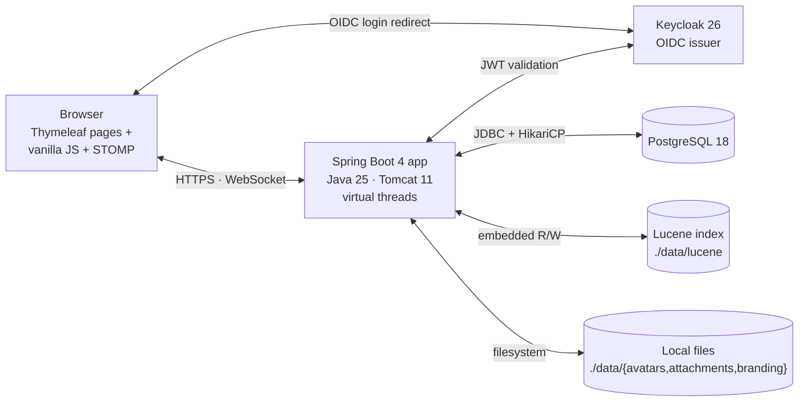
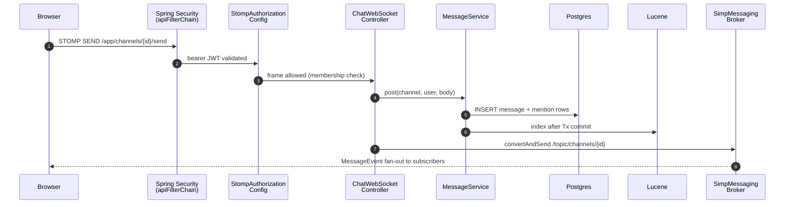
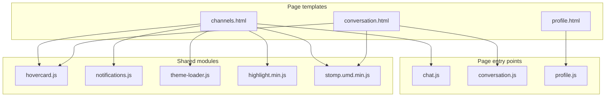

# IntelliStream Chat — self-hosted team chat, built to last

Slack/Mattermost-style workspace chat: channels, threads, direct and group messages, reactions,
mentions, presence, polls, slash commands, full-text search, streamed file uploads, 1:1 voice and
video calls, and OIDC single sign-on. One JVM process, one Postgres database, one systemd unit.

**[intellistream-datahub.github.io/intellistream-chat](https://intellistream-datahub.github.io/intellistream-chat/)** — screenshots, feature tour and the full manual.

<a href="https://intellistream-datahub.github.io/intellistream-chat/">
  <picture>
    <source media="(prefers-color-scheme: dark)" srcset="docs/shots/hero-dark.webp">
    <!-- width only, no height: GitHub's markdown CSS caps images at max-width:100% without
         setting height:auto, so a height attribute stays pinned while the width shrinks to the
         ~880px README column — which renders this 1200x733 shot 195px too tall. -->
    
  </picture>
</a>

Built on Java 25, Spring Boot 4, PostgreSQL 18, Keycloak and embedded Apache Lucene. A stack chosen
for how well it ages, not for how new it is.

## Quick start

Five commands to a running workspace on your own machine.

```bash
# 1. Clone
git clone https://github.com/IntelliStream-DataHub/intellistream-chat.git
cd intellistream-chat

# 2. Install Java 25, Podman and jq
#    Fedora / RHEL / AlmaLinux
sudo dnf install -y java-25-openjdk-devel podman podman-compose jq
#    Ubuntu / Debian
sudo apt install -y openjdk-25-jdk podman podman-compose jq

# 3. Start Postgres 18, Keycloak 26 and the TURN relay that carries calls
podman compose up -d

# 4. Export the dev OIDC client secret, and point the app at the relay
export KEYCLOAK_CLIENT_SECRET=$(jq -r '.clients[] | select(.clientId=="ichat-client") | .secret' keycloak/realm.json)
export ICHAT_TURN_URLS=turn:127.0.0.1:3478?transport=udp
export ICHAT_TURN_SECRET=dev-turn-secret

# 5. Run it
./gradlew bootRun
```

Open <http://localhost:8080> and sign in as `alice` / `alice`. The Keycloak admin console is on
<http://localhost:8081> with `admin` / `admin`. First `podman compose up` takes 15 to 30 seconds
while Keycloak imports the `ichat-realm` realm and its two test users, `alice` and `bob`.

Step 4 is needed in every new shell you start the app from. `KEYCLOAK_CLIENT_SECRET` has no
default, and the app fails fast — printing that same `jq` line — rather than starting into a login
that would break at the token exchange. The two `ICHAT_TURN_*` values have no defaults either, and
until both are set the call buttons are not rendered at all: with `force-relay` on there is no
media path without a relay, so the feature fails closed rather than offering a button that cannot
work. See [Quick start — development (detail)](#quick-start--development-detail).

To try a call, sign in as `alice` in one browser and `bob` in another, open a direct message and
press the phone or camera button. It only works on `localhost` — `getUserMedia` needs a secure
context and `localhost` is the only origin exempt from HTTPS, so over a LAN IP the camera and
microphone are blocked with no prompt and no useful error. The buttons appear in direct messages
only; a channel has no single person to ring.

Docker works too if you already have it; the compose file is plain OCI.

**When you're done.** `Ctrl-C` in the terminal running `./gradlew bootRun` stops the app — Gradle
reports the cancelled run as a failed build, which is expected and not an error on your part. Then
stop the containers:

```bash
podman compose down      # stop Postgres, Keycloak and coturn; chat history survives
podman compose down -v   # also wipe the Postgres volume — chat history gone, fresh schema on next up
```

The `intellistream-chat-pg` volume is the only difference between those two. Keycloak keeps no
volume of its own — it runs `start-dev` against a database inside the container — so the realm
re-imports on either form and `alice` and `bob` come back regardless. coturn keeps no state at all;
it holds relay allocations in memory for the length of a call.

Neither form touches `data/`, where attachments, avatars and the Lucene search index live on the
host rather than in a container. For a genuinely clean slate, remove that directory as well.

**Deploying to a server rather than trying it out?** That is a different job, and it has its own
guides: [`QUICKSTART-MANUAL.md`](QUICKSTART-MANUAL.md) for PostgreSQL and Keycloak on the host plus
the installer script and the hardened systemd unit, [`QUICKSTART-COMPOSE.md`](QUICKSTART-COMPOSE.md)
for containers all the way down, and [`frontend.md`](frontend.md) for the reverse proxy and TLS.

### It fits on a very small machine

Measured, not estimated: the whole application boots and serves inside a hard
`MemoryMax=900M` / `CPUQuota=100%` cgroup, peaking at **490 MB** with `-Xmx320m` while posting,
threading and searching. One core, well under a gigabyte, and no second service to run because the
search index is embedded and the message broker is in-process.

Those numbers do not include calls. Media never touches this process — it goes through the TURN
relay — but the relay is bandwidth the box has to have: about 128 kbit/s per voice call and 4 Mbit/s
per video call, both directions counted. A workspace that calls as well as types needs to be sized
for that separately.

That is enough for a workspace of around a thousand people. The arithmetic is the measured
per-connection cost from [`scalability.md`](scalability.md): 82 KB per WebSocket connection, so a
thousand people connected at once is roughly 82 MB on top of the base footprint. The message rate
is not the constraint either, a thousand-person workspace produces a handful of messages a second
and one core handles far more than that. Memory is what you size for, and a 1 GB VM has room.

## Why this exists

Workplace chat is important infrastructure. We should stop handing the keys to a vendor whose
interests do not include making sure you can still read your own conversations next year. The
ability to self-host isn't a feature; it's a right.

**Slack** is mostly good. The UI is slow, and the product is proprietary, cloud-only, and your
archive is governed by the vendor's pricing tiers and retention rules. The cost-per-seat and the
visibility horizon are theirs to set. That's a workable trade for plenty of teams. It isn't workable
for regulated industries, security-conscious organisations, or anyone who'd rather not have their
internal knowledge graph held off-premises.

**Mattermost** sold itself as the open-source Slack alternative, and for a while it was. Then the
free edition started taking things back. SAML and OAuth2 logins are paywalled. Team message history
is capped at 10,000 messages. You can still self-host the binary, but the open-core playbook is at
work: the things that separate a real chat app from a demo keep migrating into the licence you have
to pay for. "Open source" stops meaning much when the table stakes aren't. The UI is genuinely slick
and responsive, which makes the direction more of a shame.

**Microsoft Teams** is the most frustrating of the bunch, I am regularly late to meetings because 
the client wants to update and restart on launch, and a UI that can freeze for seconds at a time.

What this is instead: a chat server you deploy on a box you control. Fast UI. No message cap. No SSO
paywall. No telemetry. No vendor able to change the terms a year from now because the funding round
demanded it. It won't have Slack's polish or Mattermost's feature breadth. It will still be readable
in five years, on a server you own, running code you can audit, under a licence that cannot be
retroactively narrowed.

## The architecture, and why each piece was chosen

The whole system is one JVM process and one database. There is no message broker to operate, no
search cluster, no Redis, no sidecar, no npm build. That is the central design decision and
everything else follows from it.

The one deliberate exception is **calls**, and it is worth stating plainly rather than hiding in a
config table. Voice and video need a TURN relay to get media past NAT, and a relay cannot live
inside the JVM, so a deployment that wants calls runs **coturn** as a second unit. It is small — one
binary, one config file, a few MB resident — and it is optional: leave it out and the call buttons
are never rendered, while everything else works exactly as described. Nothing else in the stack has
been allowed to grow a second process, and this one is a real cost, not a free feature.

| Layer | Choice | Why                                                                                                                                                                                               |
|---|---|---------------------------------------------------------------------------------------------------------------------------------------------------------------------------------------------------|
| Language | **Java 25** | Virtual threads make a connection-per-user server cheap without async plumbing. A language with a 30-year compatibility record and tooling that will still work in a decade.                      |
| Framework | **Spring Boot 4** | The most thoroughly documented server framework in existence. Any problem you hit has been hit before, in public, with an answer.                                                                 |
| Storage | **PostgreSQL 18** | One database for everything. Schema changes go through Flyway migrations with `ddl-auto=validate`, so the schema is always exactly what the code expects.                                         |
| Search | **Embedded Apache Lucene** | Real full-text search — the same engine under Elasticsearch — with no second service to run, monitor or keep in sync. The index lives on local disk and rebuilds itself from Postgres on startup. |
| Identity | **Keycloak (OIDC)** | Authentication is a solved problem owned by people who specialise in it. This codebase contains no password hashing, no session store, no reset flow — deliberately.                              |
| Realtime | **STOMP over native WebSocket** | An in-process broker that does over 100,000 deliveries/second. No Apache Pulsar until you actually need multiple nodes.                                                                           |
| Frontend | **Thymeleaf + vanilla JS** | Server-rendered HTML and hand-written ES modules, bundled at build time by Closure Compiler. No npm dependency tree, no framework migration every three years, no supply-chain surface.           |

Every one of those is replaceable behind an existing seam — see
[What's intentionally under-engineered](#whats-intentionally-under-engineered-so-a-fork-can-swap-it).

## Performance

Measured on one Broadwell 12-core / 31 GB virtual machine with the load generator running 
**on the same box**, so these are floors rather than ceilings. Full method, raw results and 
analysis in [`scalability.md`](scalability.md); the harness is in [`benchmark/`](benchmark/).

| | |
|---|---|
| Messages persisted + delivered | **17,066 / second**, p50 21.6 ms end-to-end, 0 dropped |
| Fan-out into 50-member rooms | **136,043 deliveries / second**, 0 dropped |
| Concurrent connections served | **100,000**, 47,484 deliveries/s, 0 dropped, p50 792 ms |
| Memory holding 100,000 connections | **11.2 GiB** RSS, whole JVM |
| Attachment upload | **~380 MB/s** (~3 Gbps) single stream |

Two design decisions behind those numbers are worth knowing before you fork:

- **The write path is batched, and broadcast waits for the commit.** `MessageWriteBehind`
  pre-allocates message ids and inserts rows in batches; a message is broadcast and indexed only
  *after* its batch commits, so nobody is ever shown a message that then failed to persist. Queues
  are sharded by channel, so per-channel ordering holds. The sender doesn't wait for any of it — the
  composer renders optimistically and reconciles on the broadcast.
- **Uploads are raw request bodies, not multipart.** Multipart's boundary scan caps throughput well
  below line rate; the file is streamed straight to disk and the metadata rides in headers.

## Built to be maintained

Performance is easy to demonstrate and hard to keep. What makes that possible here is that the
codebase is small, conventional and covered:

- **981 tests across 101 classes** (47 integration, 54 unit), running in about six minutes.
  Integration tests run against a real PostgreSQL via Testcontainers — never H2, which silently
  accepts SQL that Postgres rejects.
- **Conventions are written down.** [`AGENTS.md`](AGENTS.md) documents the decisions you cannot infer
  from the code: the two security filter chains, `requireMember` vs `requireWriteAccess`, why
  broadcast happens after commit, why there is no SockJS. Read it before your first change.
- **Security posture is explicit.** A strict CSP with no inline script, two separate filter chains,
  STOMP `SUBSCRIBE` authorisation, server-side Markdown rendering sanitised with jsoup, and a
  hardened systemd unit that scores 4.6 OK on `systemd-analyze security`. The open items are listed
  honestly in [`AUDIT.md`](AUDIT.md) and [`SECURITY.md`](SECURITY.md).
- **One artifact, one unit file.** `./gradlew assemble` produces a single runnable jar. Deployment is
  copying it and `systemctl restart`.

**Maturity:** 1.0, under active development. Tested and audited: 981 tests across 101 classes, the
integration suite runs against a real PostgreSQL, and the installer is verified end to end on
AlmaLinux 10.2 with SELinux enforcing. What it has not had is years of production exposure across
many deployments, so read the code before trusting it with anything sensitive, follow the hardening
checklist in [`SECURITY.md`](SECURITY.md) before exposing an instance, and keep backups.

## Use as a starting point

If you want a team-chat tool that doesn't quite match Slack or Mattermost — internal-only,
compliance-locked, embedded inside another product, an unusual channel taxonomy, a domain-specific
slash-command surface — this codebase is small enough to fork and shape rather than build from
scratch. A feature typically touches one service, one controller, one migration and one test class.

1. **Fork the repo and rename.** The name lives in several distinct slugs, on purpose — rename each
   deliberately rather than with one global search-and-replace:

   | Slug | Used for |
   |---|---|
   | `ai.intellistream.chat` | Java package |
   | `ichat` | config property prefix (`ichat.search.lucene-dir`, …) |
   | `ICHAT_` | environment variables (`ICHAT_DB_URL`, …) |
   | `ichat-realm` / `ichat-client` / `ichat-*` roles | Keycloak realm, OIDC client, realm roles |
   | `ichat_role` / `intellistream_chat` | Postgres role and database |
   | `intellistream-chat` | Gradle artifact, systemd unit, `/opt` path |

   Then regenerate `V1__init.sql`.
2. **Read `AGENTS.md` and keep it current.** It is the conventions document for the project, and it
   is worth more to a new contributor than any amount of generated API documentation. Update it as
   your fork diverges.
3. **Write the change down before writing it.** Acceptance criteria beat prose: *"polls auto-close
   after 7 days; closed polls show the winner above the option list; admins can re-open a closed poll
   within 24 hours."*
4. **Follow the existing shape.** New slash command? Model it on `PollCommand`. New entity? Flyway
   migration plus a JPA entity plus a repository. New endpoint? Decide `requireMember` or
   `requireWriteAccess` first.
5. **Keep the suite green.** Add a unit test for pure logic and an integration test under
   `integration/` for anything database-shaped. The existing 981 tests are the floor, not the ceiling.

### What's intentionally under-engineered (so a fork can swap it)

These pieces are deliberately simple, behind a seam, so a fork can replace them without a rewrite:

| Today | Swap to, when |
|---|---|
| In-memory `RateLimiter` | Bucket4j-with-Hazelcast or Redis-backed (multi-replica deploy) |
| Embedded Lucene at `./data/lucene` | Elasticsearch / OpenSearch behind `MessageIndexService` (>10M messages or distributed search) |
| In-memory STOMP broker (`SimpleBrokerMessageHandler`) | RabbitMQ / ActiveMQ STOMP plugin (multi-replica WebSocket) |
| Local-disk attachments under `./data/attachments` | S3 SDK behind `AttachmentService` (cloud deploy / object storage) |
| Per-process slash-command registry | Plug-in loader (custom internal commands without a fork-of-the-fork) |

### Conventions to keep when extending

- **Two filter chains** in `SecurityConfig`. Browser pages and `/api/**` / `/ws/**` have very
  different auth postures (CSRF on/off, stateful/stateless). Merging them re-introduces classic
  CSRF-via-XHR bugs.
- **`CurrentUser` indirection.** Don't read JWT / `OidcUser` claims in controllers — go through
  `currentUser.resolve(principal)`. Provisioning the domain `User` row from the OIDC subject is the
  *only* place that should happen.
- **`requireMember` for read, `requireWriteAccess` for write.** PUBLIC channels are world-readable
  but never world-writeable; mix the two checks up and you've quietly broken that.
- **Strict CSP — no inline `<script>`, no SockJS.** Inline blocks and SockJS's `iframe` /
  `htmlfile` / `jsonp-polling` transports both require relaxing the CSP. Extract to `static/js/`.
- **`ddl-auto=validate` + Flyway.** Schema changes are migrations under `db/migration/V*.sql`, not
  `ddl-auto=update`. Don't flip the switch.
- **Testcontainers + real Postgres, no H2.** The schema uses Postgres-only features (`generated by
  default as identity`, partial indexes, named-constraint syntax). H2 silently accepts invalid SQL
  and lies to you.

If your fork ends up generally useful, send a PR back — generic improvements (distributed rate
limiter, S3 attachment backend, pluggable slash-command loader) are welcome upstream.

## Prerequisites

Before the Quick start you need a Java 25 JDK and (for the container path) Podman. Gradle itself is not required — `./gradlew` downloads it on first use.

### AlmaLinux / Rocky / RHEL 10+

```bash
sudo dnf install -y java-25-openjdk-devel podman podman-compose
java -version    # should report "openjdk 25"
```

### Ubuntu 24.10+ / Debian trixie

```bash
sudo apt install -y openjdk-25-jdk podman podman-compose
java -version
```

Ubuntu 24.04 LTS and later package `openjdk-25-jdk`, as does Debian 13. Only Debian 12 and Ubuntu releases older than 24.04 need [SDKMAN](https://sdkman.io) or Adoptium.

### macOS

```bash
brew install openjdk@25 podman
brew services start podman    # or: podman machine init && podman machine start
```

If `java` doesn't end up on `PATH`, follow the post-install instructions Homebrew prints (`echo 'export PATH="/opt/homebrew/opt/openjdk@25/bin:$PATH"' >> ~/.zshrc` on Apple silicon).

## Quick start — development (detail)

The short version is at the top of this file. What follows is the same flow with the optional paths: the prod profile, an external database, and Vault.


For exploring the app, hacking on it, or quick local testing. Three commands once the prerequisites above are installed:

```bash
podman compose up -d   # Postgres 18 + Keycloak 26, with the 'ichat-realm' realm pre-imported
export KEYCLOAK_CLIENT_SECRET=$(jq -r '.clients[] | select(.clientId=="ichat-client") | .secret' keycloak/realm.json)
./gradlew bootRun      # the Spring Boot app on :8080
```

The `export` is not optional and is not a production-only step — the dev profile has no secret of
its own either, so a plain `./gradlew bootRun` in a fresh shell stops at `OidcClientSecretCheck`
before Tomcat binds.

Open http://localhost:8080 and sign in as `alice` / `alice` or `bob` / `bob`. Keycloak admin console is at http://localhost:8081 (`admin` / `admin`).

If `podman compose` can't find a socket, run once: `systemctl --user enable --now podman.socket && export DOCKER_HOST=unix:///run/user/$(id -u)/podman/podman.sock`.

To boot with the production profile locally (for verification — the build wires `bootRun` to `--spring.profiles.active=dev` only when `SPRING_PROFILES_ACTIVE` is unset), keep the containers from above running, then:

```bash
export KEYCLOAK_CLIENT_SECRET=$(jq -r '.clients[] | select(.clientId=="ichat-client") | .secret' keycloak/realm.json)
SPRING_PROFILES_ACTIVE=prod ./gradlew bootRun
```

`KEYCLOAK_CLIENT_SECRET` has no default (`application.yml` deliberately leaves it empty rather than falling back to the secret baked into `keycloak/realm.json`), so it must be set explicitly in every profile, dev included. The app **refuses to start** without it — an empty string is a valid property value, so previously the context came up, `/actuator/health` returned 200, and then every login died at the token exchange and bounced to `/login?error` with nothing in the log. See `OidcClientSecretCheck`.

### Quick start — without Podman (external Postgres + Keycloak)

Already running Postgres 18 and Keycloak 26 elsewhere (managed cloud, a host install, a shared dev environment)? Skip `podman compose` and point the app at them via env vars:

```bash
export ICHAT_DB_URL=jdbc:postgresql://db.example.com:5432/intellistream_chat
export ICHAT_DB_USERNAME=ichat_role
export ICHAT_DB_PASSWORD=...
export KEYCLOAK_ISSUER_URI=https://auth.example.com/realms/ichat-realm
export KEYCLOAK_CLIENT_SECRET=...
./gradlew bootRun
```

The Keycloak realm definition you'll need is in `keycloak/realm.json` — import it via the admin console (**Realms → Import**) or `bin/kcadm.sh create realms -f keycloak/realm.json`. Once imported, regenerate the client secret (the bundled one is in this public repo) and use the new value for `KEYCLOAK_CLIENT_SECRET`. Flyway runs the schema on first boot — no manual SQL setup beyond `CREATE DATABASE intellistream_chat OWNER ichat_role`. See [Without containers (native install)](#without-containers-native-install) for a step-by-step host install of both, and [Keycloak realm](#keycloak-realm) for the realm/client knobs.

To pull `ICHAT_DB_PASSWORD` and `KEYCLOAK_CLIENT_SECRET` from a Vault / OpenBao KV-v2 record instead of plain env vars:

```bash
export ICHAT_VAULT_ENABLED=true
export ICHAT_VAULT_URI=https://vault.example.org:8200
export ICHAT_VAULT_TOKEN=...
export ICHAT_VAULT_PATH=intellistream-chat     # default; maps to secret/data/intellistream-chat
./gradlew bootRun
```

The five expected keys (`db.username`, `db.password`, `keycloak.client-id`, `keycloak.client-secret`, `keycloak.issuer-uri`) and a try-it-locally OpenBao recipe are in [Optional: Vault / OpenBao secret backend](#optional-vault--openbao-secret-backend).

For container-free setup, see [Without containers (native install)](#without-containers-native-install) below.

## Quick start — production

For a real internet-facing deployment. **Do not skip the hardening steps**: the bundled defaults are tuned for local dev and would be embarrassing on the public internet.

```bash
# 1. Build a runnable jar
./gradlew assemble                # produces build/libs/intellistream-chat-<version>.jar

# 2. Stand up Postgres 18 + Keycloak 26 on the host (see "Without containers" below)
#    or your managed equivalents. Point the app at them via env vars.

# 3. Configure the production env. Each line below is required.
export ICHAT_DB_URL=jdbc:postgresql://db.internal:5432/intellistream_chat
export ICHAT_DB_USERNAME=ichat_role
export ICHAT_DB_PASSWORD=$(openssl rand -base64 32)
export KEYCLOAK_ISSUER_URI=https://auth.example.com/realms/ichat-realm
export KEYCLOAK_CLIENT_SECRET=$(openssl rand -base64 32)   # rotate from the dev default
export SERVER_ADDRESS=127.0.0.1                            # bind localhost only; nginx fronts it
# The cookie Secure flag auto-detects from X-Forwarded-Proto (forward-headers-strategy:
# framework, already set in application.yml), so there is nothing to configure here as long
# as your proxy forwards it.

# 4. Run behind a TLS-terminating reverse proxy (see frontend.md in this repo):
java -jar build/libs/intellistream-chat-*.jar
```

Then complete the [production hardening checklist](#production-hardening-checklist) below before flipping DNS.

## Production: reverse proxy

[`frontend.md`](frontend.md) covers what to put in front of the JVM: complete nginx and
haproxy configs, how to size `worker_connections`/`maxconn` for a connection-heavy workload,
the upstream ephemeral-port limit that bites long before the app runs out of memory, and the
one deployment mistake that silently breaks login (Keycloak must share a registrable domain
with the app, because the session cookie is `SameSite=Strict`).

## Production: JVM tuning

The bare `java -jar …` line above gets you running once. For an actual deployment, run under systemd so the OS supervises the process, restarts it on crash, captures logs to `journald`, and applies basic sandboxing.

### The systemd unit

Lives in [`QUICKSTART-MANUAL.md`](QUICKSTART-MANUAL.md#5-systemd-service), next to the install steps
that need it, annotated directive by directive. `scripts/install-almalinux.sh` writes exactly that
text, so there is one copy of the unit and it cannot drift from what gets installed. This section
is the tuning that goes *inside* it.


### JVM options

Defaults that fail fast and dump enough to debug:

| Flag | Why |
|---|---|
| `-Xms512m -Xmx1g` | A modest floor and ceiling, which is what the installer writes. This app is self-hosted on hardware it cannot predict: a five-person workspace should not reserve memory it never touches, and a thousand-person one should not be capped. 1 GiB comfortably handles low-thousands of concurrent WebSocket sessions; raise the ceiling past ~5k concurrent users or a large Lucene index. **On a machine with memory to spare, set `-Xms` equal to `-Xmx`.** G1 sizes the young generation from the *current* heap, so a 512 MiB floor starts with a ~26 MiB eden and collects more often until the heap grows into its steady state — worst during startup, when the index is loading and sockets are attaching. It also gives a predictable RSS to size a `MemoryMax=` against. |
| `-XX:+UseG1GC` | Not needed — G1 is the JVM default and is the right collector at this heap size. Do not reach for ZGC here; see below. |
| `-XX:+ExitOnOutOfMemoryError` | Don't limp along with a half-broken VM — let systemd restart instead. |
| `-XX:+HeapDumpOnOutOfMemoryError -XX:HeapDumpPath=…` | A 1 GiB heap dump is small. You'll want it the next time OOM hits. Make sure the path is writable and rotated occasionally. |
| `-XX:+UseStringDeduplication` | G1-only. Collapses duplicate `String` byte arrays — free win on a chat app where the same usernames / channel names appear in every message DTO. |
| `-XX:+AlwaysPreTouch` | Pre-faults every heap page at startup: ~1 s of boot for no first-allocation jitter later. Only worth setting alongside `-Xms` = `-Xmx`, since it pre-faults the *initial* heap — with a 256 MiB floor it touches an eighth of what you will end up using. Not in the shipped default for that reason. |
| `-Duser.timezone=UTC` | Container hosts often default to local TZ; pin to UTC so log timestamps line up with your dashboards. |

Things you do **not** need to set:

- `-XX:MaxRAMPercentage` — only useful when running in a container with a cgroup limit and no fixed `-Xmx`.
- `-XX:+UseCompressedOops` — already on for any heap < 32 GiB.
- `--enable-preview` — Spring Boot 4 doesn't use preview language features here.

The app already enables **virtual threads** via `spring.threads.virtual.enabled=true` in `application.yml`, so your servlet + WebSocket handlers run on Project Loom green threads. That keeps the OS thread count flat regardless of WebSocket fan-out, and shifts the bottleneck from "thread pool exhausted" to "GC throughput" — which leads to the next section.

### What about ZGC / generational ZGC?

Stay on G1 unless pauses are actually hurting you. The deciding question is not how big the heap is
— it is whether anyone can tell when a collection happens.

G1 is a large-heap collector: it runs 30–64 GiB heaps routinely, and its young pauses scale with the
*live young data*, not with the size of the heap, so they do not grow just because you gave it more
memory. At a 100 ms tolerance — which a chat server has, being a WebSocket fan-out rather than a
trading system — G1 at 30 GiB is the better choice, not a compromise. **ZGC** and **Shenandoah**
trade ~15% RAM and ~10% throughput for sub-millisecond pauses, and if nobody would have noticed the
pause, that is a bill for nothing.

Two things do change as the heap grows, and neither is fixed by switching collector:

- **The risk stops being the routine pause and becomes the full GC.** G1 usually meets its pause
  goal; what hurts at 30 GiB is an evacuation failure, which degrades to a full GC measured in
  seconds. Give it headroom, and lower `-XX:InitiatingHeapOccupancyPercent` so concurrent marking
  starts earlier if you see them in the log.
- **Do not cross 32 GiB.** Compressed object pointers switch off there (verified on the OpenJDK 25
  this ships against: on at `-Xmx31g`, off at `-Xmx32g`), and every reference in the heap doubles in
  width. A 32 GiB heap holds *less* usable data than a 31 GiB one. If you genuinely need more,
  the next useful size is a long way above 32 GiB, not just over it.

Switch to ZGC when a GC pause is visible to users and you have measured that it is the pause, not
the database or the network. That is a real case above ~4 GiB with strict latency goals — the
benchmarks in `scalability.md` use it for exactly that reason at 100,000 connections and an 11.2 GiB
heap. For that:

```bash
JAVA_OPTS=-XX:+UseZGC -Xms4g -Xmx4g -XX:+ExitOnOutOfMemoryError -XX:+HeapDumpOnOutOfMemoryError -XX:HeapDumpPath=/opt/intellistream-chat/data/heapdumps -Duser.timezone=UTC
```

(Drop `+UseStringDeduplication` under ZGC — it is a G1 feature. Fix `-Xms` to `-Xmx` at that
size, so the RSS is predictable and the heap is not resized while 100,000 sockets are attached.)

## Production: SELinux on AlmaLinux / RHEL

AlmaLinux 10 (and Rocky / RHEL 10) ships SELinux in **enforcing** mode by default. The systemd unit above runs the JVM in the `unconfined_service_t` domain, so the JIT (writable + executable pages) and the OIDC / JDBC outbound connections work without custom policy. What you do need to set up is **file labels on the data directory** and **one nginx boolean** so the reverse proxy can reach the JVM on `127.0.0.1:8080`.

```bash
# 0. Sanity check — should print "Enforcing".
getenforce

# 1. Make sure the policy management tools are installed (they aren't always pulled in on minimal images).
sudo dnf install -y policycoreutils-python-utils setools-console

# 2. Label /opt/intellistream-chat/data so writes survive a relabel (`restorecon -R /` or a touched .autorelabel).
#    var_lib_t is the catch-all label for system services' state directories.
sudo semanage fcontext -a -t var_lib_t '/opt/intellistream-chat/data(/.*)?'
sudo restorecon -Rv /opt/intellistream-chat

# 3. Allow nginx (httpd_t) to make outbound connections to the JVM on localhost:8080.
sudo setsebool -P httpd_can_network_connect on

# 4. Port labels. Stock http_port_t on AlmaLinux 10 covers 80, 81, 443, 488, 8008, 8009,
#    8443 and 9000 — note that 8080 is NOT among them. Check yours rather than assume:
#      semanage port -l | awk '$1=="http_port_t"'
#    This only bites if you confine the JVM to a domain that enforces port labels; the
#    unit above runs unconfined_service_t, which does not. Label it anyway if you later
#    write a custom domain:
#    sudo semanage port -a -t http_port_t -p tcp 8080
```

The systemd unit's `ReadWritePaths=/opt/intellistream-chat/data` and SELinux's file context for the same path are independent layers — both must be correct. The systemd one stops the JVM from writing outside the data dir; the SELinux one stops it from writing inside the data dir if the labels are wrong.

### When something gets denied

The JVM will fail to start, attachments will fail to upload, or nginx will return `502` and there will be **nothing useful** in `journalctl -u intellistream-chat` — SELinux denials land in the audit log, not the service log. Check both:

```bash
sudo ausearch -m AVC,USER_AVC -ts recent
sudo journalctl -u intellistream-chat -p err --since "10 min ago"
```

Common AVCs and their fixes:

| Symptom | Fix |
|---|---|
| `denied { write } ... path="/opt/intellistream-chat/data/..."` | The `restorecon` step was skipped, or the directory was created **after** `semanage fcontext`. Re-run `sudo restorecon -Rv /opt/intellistream-chat`. |
| `denied { name_connect } ... port=8080` from `httpd_t` | nginx can't reach the upstream — `sudo setsebool -P httpd_can_network_connect on`. |
| `denied { name_bind } ... port=NNNN` from the JVM | You've bound to a port the policy doesn't recognise as HTTP — `sudo semanage port -a -t http_port_t -p tcp NNNN`. |
| `denied { read } ... path="/etc/intellistream-chat/env"` | Custom env file location with the wrong label. Either keep it under `/etc/` (already `etc_t`) or label it: `sudo semanage fcontext -a -t etc_t '/path/to/env'; sudo restorecon -v /path/to/env`. |

### Don't reach for `setenforce 0`

If something breaks, capture the denial and write a targeted local module — don't disable enforcement.

```bash
sudo ausearch -m AVC -ts recent | audit2allow -a -M intellistream-chat-local
less intellistream-chat-local.te                  # review before loading
sudo semodule -i intellistream-chat-local.pp
```

`sudo setenforce 0` is OK as a single-session debug hatch (turn it back on with `setenforce 1`), but never persist permissive across reboots and never edit `/etc/selinux/config` to `SELINUX=disabled` — re-enabling later forces a full relabel.

If you co-locate Postgres on the host, keep `PGDATA` under the default `/var/lib/pgsql/`; moving it elsewhere needs `semanage fcontext -a -t postgresql_db_t '...'`.

## Features

- Sign in with **Keycloak** (OAuth2 / OIDC).
- **Channels** (public + private). Anyone can join public channels; private channels require an admin invite. Channel admins can invite members, promote others, rename the channel and edit its description, and **archive** it — read-only and out of the way, reversibly. Members can **leave**; when the last admin goes, the role passes to the longest-standing member rather than stranding the channel. Deleting a channel outright is a workspace-admin action, because it takes everyone else's messages and files with it — from the channel's own settings, or from the admin console for a private channel the admin is not in. The sidebar lists **every channel you are in**, alphabetically, with favourites pinned to the top.
- **Direct messages** (1:1 and group), the same surface as a channel: threads, typing indicators, read state, reactions, attachments, and a per-conversation notification level so a busy group DM can be muted. You can leave a group; a 1:1 you simply stop using. The DM list lives alongside channels in the sidebar, with a "Send DM" entry point on every avatar hovercard. A conversation with yourself is a real one — it is where your reminders land.
- **Real-time messaging** over native STOMP-over-WebSocket — messages, edits, deletes, and avatar updates fan out live.
- **Threaded replies** that mark the channel unread and notify the people in the thread, **emoji reactions** (including on your own messages), **mentions** with an `@`-typeahead that matches display names as well as handles, plus **`@channel` / `@here`**, **per-user read state**, **typing indicators**, and **message permalinks** that survive the login round-trip. Unread reads the way it does in Slack: a bold channel name, and a number only when someone used your name.
- **Pin** a message to the channel, **save** one to a private list, **forward** it elsewhere, or **quote** it into a reply. Forwarding out of a private channel asks first.
- **File attachments** uploaded as a raw request body streamed straight to disk — no multipart parsing, no buffering; image attachments open in a lightbox.
- **Profile pictures** with server-side resize (PNG/JPEG ≤256px), live broadcast on change.
- **Avatar hovercard** with profile info + "Send direct message" action.
- **@mention notifications**: in-tab toast plus opportunistic OS notification (Notification API) when permitted, and a notification sound you can set separately for mentions and direct messages (fifteen to choose from, synthesised in the browser — no audio files to ship or serve).
- **Do Not Disturb** that actually silences — toast, sound and OS notification — while unread counts and the mention inbox keep working, because silencing an interruption is not the same as hiding information.
- **Per-channel notification levels**, on the Slack/Mattermost model: an account-wide default (*every message* / *mentions* / *nothing*) and a per-channel override whose default value is **inherit**, not a copy — change the account setting and every channel you haven't explicitly overridden moves with it. Muting is the bottom of that same control rather than a separate flag, and a muted channel still counts unread; it just stops interrupting.
- **Markdown** message bodies — server-side render with CommonMark + GFM tables + autolinks, sanitized with jsoup, fenced-code syntax highlighting via highlight.js, and link previews / embedded YouTube.
- **Full-text search** powered by an embedded **Apache Lucene** index, on a results page with counts and paging rather than a dropdown that guesses. Slack's syntax: `from:@bob` for what someone wrote, `@bob` for where they were mentioned, `in:#channel` to narrow. It reaches **every channel you are allowed to read**, not only the ones you joined, and matches **attachment filenames** as well as message text — the authorisation is a clause inside the Lucene query, never a filter applied afterwards. Admins can additionally search private channels they are not in.
- **Themes** (20 built-in palettes, five of them dark) chosen on the profile page.
- **Slash commands** — `/help`, `/poll`, `/remind`. A `/word` that names no command is refused privately and never posted, so a mistyped `/leave` does not become a message the whole room reads. Reminders arrive as a direct message, at the time your own timezone says, not as an announcement in the channel you set them from.
- **Files** — browse what has been shared in a channel, or your own uploads across every channel and DM, with a per-account storage quota. Filenames are searchable.
- **Admin console** at `/admin` for users with the Keycloak `ichat-admin` realm role. A bare `admin` role is deliberately ignored: administering the identity provider is not the same as administering this chat.

## Stack

### Runtime / build
- **Java 25** toolchain
- **Spring Boot 4.1.0**, Gradle Kotlin DSL
- **PostgreSQL 18** (bigint identity PKs, partial indexes)
- **Keycloak 26** as the OIDC issuer (runs out-of-process via `podman compose`)

### Spring Boot starters
| Starter | Brings in |
|---|---|
| `spring-boot-starter-web` | Spring MVC + embedded Tomcat 11, Jackson |
| `spring-boot-starter-websocket` | STOMP-over-WebSocket message broker |
| `spring-boot-starter-thymeleaf` | Thymeleaf 3.1 server-side templates |
| `spring-boot-starter-data-jpa` | Spring Data JPA + Hibernate ORM 7 |
| `spring-boot-starter-security` | Core Spring Security (filter chains, CSRF, headers) |
| `spring-boot-starter-oauth2-client` | OIDC login flow against Keycloak |
| `spring-boot-starter-oauth2-resource-server` | Bearer-JWT validation on `/api/**` and `/ws/**` |
| `spring-boot-starter-validation` | Hibernate Validator 9 for `@Valid` request bodies |
| `spring-boot-starter-actuator` | Health + metrics endpoints |
| `spring-boot-flyway` + `flyway-core` + `flyway-database-postgresql` | Schema migrations (`db/migration/V*.sql`) |

### Auxiliary Spring pieces
- `spring-security-messaging` — STOMP-frame authorization (`StompAuthorizationConfig`)
- `thymeleaf-extras-springsecurity6` — `sec:authorize` attributes in templates

### Storage
- **Hibernate ORM 7.2** (transitive via Spring Data JPA), `ddl-auto=validate`
- **PostgreSQL JDBC 42.7** (runtime only)
- **HikariCP** connection pool (Spring Boot default)
- **Flyway 11** migrations

### Domain libraries
- **CommonMark 0.22** + GFM-tables and autolink extensions — server-side Markdown rendering (`MarkdownRenderer`)
- **jsoup 1.18** — HTML sanitization with a tightened `Safelist.basic` after Markdown render
- **Apache Lucene 10.5** (`core`, `analysis-common`, `queryparser`) — embedded full-text index at `./data/lucene` (`MessageIndexService`); documents are written after the message row commits, on a dedicated indexer thread. No Postgres `tsvector`, no ILIKE.

### Frontend
- Thymeleaf templates + hand-written vanilla JS (no React/Vue/Svelte, no npm bundler)
- Vendored under `static/js/vendor/`: **StompJS** (WebSocket STOMP client) and **highlight.js** (code-block syntax highlighting)
- STOMP rides on **native WebSocket only** — no SockJS fallback (its inline-script transports break the strict CSP)

### Test stack
- **JUnit 5** (Jupiter) via `spring-boot-starter-test`
- **AssertJ**, **Mockito** (transitive)
- `spring-security-test` for security helpers
- **Testcontainers BOM 2.0.5** (`postgresql` + `junit-jupiter`) — real Postgres 18 per IT class (no H2)
- `spring-boot-testcontainers` for `@ServiceConnection` wiring

### Code generation
- **Lombok 1.18.38** — `@Getter` / `@Setter` / `@NoArgsConstructor(access = PROTECTED)` on JPA entities only. DTOs stay as records (records cover the immutable-data-class case the language already gives us). Side-effecting setters (`setBodyMarkdown` bumps `editedAt`, `setAvatar` bumps `avatarUpdatedAt`, `pin/unpin`, `markRead`) are written by hand — Lombok skips generation when a same-signature method already exists.

### Notably absent (intentional)
- No MapStruct (manual `from(...)` factory methods on DTOs instead — keeps the mapping visible)
- No reactive stack (no WebFlux, R2DBC)
- No Spring Cloud, no external message broker beyond the in-memory STOMP broker
- No H2 / HSQLDB — production schema uses features H2 won't accept

## Architecture

### Deployment overview

One JVM, three external dependencies (Keycloak, Postgres, a local data directory). Lucene is embedded; STOMP runs against Spring's in-memory `SimpleBrokerMessageHandler`, no Redis or RabbitMQ.



### Backend request lifecycle

What happens when the browser sends a chat message over STOMP:



Two `SecurityFilterChain` beans split the auth posture: `apiFilterChain` (order 1) handles `/api/**` and `/ws/**` with stateless bearer JWT (no CSRF). `webFilterChain` (order 2) handles browser page loads with stateful OIDC session and CSRF cookies. `StompAuthorizationConfig` is a separate `ChannelInterceptor` that enforces channel/conversation membership on every `SUBSCRIBE` frame.

### Frontend module composition

Each page is a Thymeleaf template that pulls in a single page-specific entry-point JS file (wrapped in an IIFE — nothing leaks to `window`). Shared modules are loaded only by the pages that need them:



Cross-module calls go through tiny `window.*` surfaces only where needed (e.g. `window.MentionNotifications.show(...)` so `chat.js` can fire a toast without importing `notifications.js` directly).

## Run locally

### With Podman compose (recommended)

The container runtime here is **Podman** (Docker is not installed in our dev env). The Quick start above covers the happy path; here are the details if you need them.

```bash
systemctl --user enable --now podman.socket
export DOCKER_HOST=unix:///run/user/$(id -u)/podman/podman.sock

podman compose up -d            # or `podman-compose up -d`
export KEYCLOAK_CLIENT_SECRET=$(jq -r '.clients[] | select(.clientId=="ichat-client") | .secret' keycloak/realm.json)
./gradlew bootRun
```

`podman compose up -d` reads `docker-compose.yml`, starts a `postgres:18-alpine` container with the `chat`/`chat`/`chat` (db/user/password) defaults, and a `keycloak:26.0` container that imports `keycloak/realm.json` on first start.

If `gradlew` is missing (fresh checkout into a tree where the wrapper isn't committed), run once: `gradle wrapper --gradle-version 9.0.0`.

### Without containers (native install)

If you'd rather run Postgres and Keycloak directly on the host (production deploy, air-gapped server, no container runtime), here's the path.

#### PostgreSQL 18

**RHEL / Fedora / Rocky:**
```bash
sudo dnf install -y postgresql18-server postgresql18
sudo /usr/pgsql-18/bin/postgresql-18-setup initdb
sudo systemctl enable --now postgresql-18
```

**Debian / Ubuntu:**
```bash
sudo apt install -y postgresql-18
sudo systemctl enable --now postgresql
```

**macOS (Homebrew):**
```bash
brew install postgresql@18
brew services start postgresql@18
```

Create the database and role:

```bash
sudo -u postgres psql <<'SQL'
CREATE USER chat WITH PASSWORD 'chat';
CREATE DATABASE chat OWNER chat;
GRANT ALL PRIVILEGES ON DATABASE chat TO chat;
SQL
```

That's all the SQL setup you need. Flyway runs the schema migration on first app start (a single consolidated V1__init.sql).

#### Keycloak 26

Keycloak needs Java 21+ — your Java 25 install is fine. Download a release and run it directly:

```bash
KC_VERSION=26.0.5
curl -L https://github.com/keycloak/keycloak/releases/download/${KC_VERSION}/keycloak-${KC_VERSION}.tar.gz | tar -xz
cd keycloak-${KC_VERSION}

# Drop the realm definition where Keycloak picks it up on import:
mkdir -p data/import
cp /path/to/this-repo/keycloak/realm.json data/import/

# Initial admin (set once before first start):
export KC_BOOTSTRAP_ADMIN_USERNAME=admin
export KC_BOOTSTRAP_ADMIN_PASSWORD=admin

bin/kc.sh start-dev --import-realm --http-port=8081
```

`start-dev` runs against an embedded H2 — fine for a quick local run. For production, switch to `bin/kc.sh start` and configure a Postgres backend (a separate database from the chat one) per Keycloak's docs.

Once Keycloak is up at http://localhost:8081 the `ichat-realm` realm exists with users `alice` / `alice` and `bob` / `bob`. Point the app at it:

```bash
export KEYCLOAK_ISSUER_URI=http://localhost:8081/realms/ichat-realm
export KEYCLOAK_CLIENT_SECRET=<value from realm.json or a fresh one you rotated to>
./gradlew bootRun
```

## Keycloak realm

The bundled `keycloak/realm.json` defines everything `podman compose` and `kc.sh start-dev --import-realm` pick up. If you build a realm from scratch in the admin UI, match the settings below.

### Realm + client

| Item | Value |
|---|---|
| Realm name | `ichat-realm` |
| Login with email | enabled |
| Self-registration | enabled |
| Client id | `ichat-client` (confidential, Authorization Code + PKCE) |
| Client secret | `(generated; rotate)` (override via `KEYCLOAK_CLIENT_SECRET` in production) |
| Valid redirect URIs | `http://localhost:8080/*` |
| Web origins | `http://localhost:8080` |

If you move the app to a different host or port, update both Valid redirect URIs and Web Origins to match. A mismatch shows up as `400 invalid_redirect_uri` from Keycloak after sign-in.

### Roles

Three realm roles ship in the bundled config:

| Role | Purpose | Granted to |
|---|---|---|
| `ichat-user` | Marker assigned to every regular account. Not consumed by the chat app itself; handy for filtering in Keycloak. | alice, bob; assign as default to self-registered accounts |
| `admin` | Keycloak's own realm admin. **Intentionally ignored** by the chat app — it carries no `ichat-` prefix, so it is not one of ours. | (Keycloak internal) |
| `ichat-admin` | Application admin. Required for `/admin` and cross-channel search. Maps to Spring's `ROLE_ADMIN` in `KeycloakRolesConverter`. | alice (in the bundled realm) |

Every role this application consumes is prefixed `ichat-`. That is the whole rule, and it exists so a role granted for some other purpose in a shared realm can never be mistaken for a grant in this app. The split is deliberate: the person who admins your Keycloak instance is not automatically a chat administrator. Promote individual users to `ichat-admin` via **Users → pick user → Role mappings → Assign role**.

### Enabling user registration

Self-registration is already on in the bundled realm. To toggle (or enable on a hand-built realm):

1. Open the Keycloak admin console at http://localhost:8081 (default `admin` / `admin`).
2. Switch to the **chat** realm in the top-left dropdown.
3. **Realm settings → Login** tab.
4. Toggle **User registration** on.
5. (Optional) **Forgot password** to expose a self-service reset link on the login page.
6. (Optional) **Verify email** to require confirmation before first login. Needs SMTP configured under **Realm settings → Email**.

Then make sure new self-registered accounts get the `user` realm role automatically:

1. **Realm settings → User registration** sub-tab (or **Realm roles → default-roles-ichat-realm**).
2. Assign realm role `ichat-user` (and any others you want every account to have).

`ichat-admin` is deliberately **not** in the default role set and should never be — promote people one at a time, after you've vetted them.

### Organizations: per-org SSO via email-domain routing (optional)

`"organizationsEnabled": true` in the bundled realm turns on Keycloak's **Organizations** feature, which lets each customer/tenant organization federate through its own upstream identity provider (their corporate Okta/Azure AD/Google Workspace/SAML IdP) while the app keeps seeing exactly one OIDC provider — its own `ichat-realm`. Keycloak does all the brokering, so **the chat app needs no code changes for this**: the same `KEYCLOAK_ISSUER_URI` / `KEYCLOAK_CLIENT_ID` / `KEYCLOAK_CLIENT_SECRET` env vars and the same "Sign in with Keycloak" link keep working unchanged. A user who doesn't belong to any organization is unaffected — they just see Keycloak's normal login/registration form, exactly as today.

Adding an organization is an admin-console task, not something that lives in `realm.json` — the bundled file only flips the feature on. In short: create the org's identity provider under **Identity providers**, create the organization with its email domain(s) under **Organizations**, then link the two on the organization's **Identity providers** tab with **Redirect when email domain matches** on. The step-by-step, including how to rehearse it with a second realm standing in for a corporate IdP, is in [`QUICKSTART-MANUAL.md`](QUICKSTART-MANUAL.md#optional-sign-in-through-each-organisations-own-idp).

Two things worth knowing before you rely on this:

- The bundled `intellistream` login theme deliberately keeps its override surface to one empty `footer.ftl` (see `keycloak/themes/intellistream/login/theme.properties`) so that features like this keep working without a theme change — it inherits every other template, including the organization-aware identity-first login page, from the base `keycloak` theme.
- New members who arrive through an org's IdP go through Keycloak's ordinary first-broker-login flow, which grants the realm's default roles (`default-roles-ichat-realm`) the same way self-registration does (see [Enabling user registration](#enabling-user-registration) above) — `ichat-user` needs to be in that default set either way, and `ichat-admin` should still only ever be granted by hand.
- Turn on **Trust Email** on each linked identity provider (Identity providers → the provider → *Trust Email*). It marks brokered accounts' emails verified, which is what lets the app recognise a person who already has an account under a previous subject — moving an existing user base into a new realm this way otherwise creates a second account per person (`ICHAT_IDENTITY_LINK_BY_VERIFIED_EMAIL`, on by default).
- Roles reach the app for brokered accounts the same way as for local ones: through the **realm roles in ID token** mapper on `ichat-client` (bundled; a hand-built realm must add it — `QUICKSTART-MANUAL.md` step 4). Organisation membership grants no role by itself. To let the org's own directory decide who is `ichat-admin`, add an *Advanced Claim to Role* mapper on the provider with sync mode **Force**; the step-by-step, and why not a hardcoded role, is in the QUICKSTART.

### Hardening registration before you expose an instance

Open registration is convenient for evaluation and is the single biggest abuse surface in
production. A ban button is whack-a-mole if the same person can register again in ten seconds, so
these matter *more* than the moderation tools, not less.

The bundled realm now ships with **brute-force protection on** (temporary lockout after 10 failures,
backing off to a 15-minute cap, counter decaying after 12 hours). Lockout is deliberately
*temporary*: permanent lockout is itself an attack, because anyone who knows a username can lock
that account out on purpose.

What is still yours to decide, in rough order of value:

| Control | Where | Note |
|---|---|---|
| **Turn registration off** | Realm settings → Login → User registration | The strongest option by far. Invite people instead; most self-hosted workspaces are not open to the public. |
| **Verify email** | Realm settings → Login → Verify email | Needs SMTP under Realm settings → Email. Off in the bundled realm because the demo users have no deliverable address and it would make the quick start fail. |
| **reCAPTCHA on registration** | Authentication → Flows → registration | Stops scripted mass-registration, which is what actually happens to an open instance. |
| **Password policy** | Authentication → Policies → Password policy | Not set in the bundled realm on purpose: the demo users are `alice`/`alice`, and a length rule would lock them out of the quick start. Set one before you expose anything. |
| **Terminate sessions on disable** | — | Handled by the app; see the moderation section. Disabling an account in Keycloak stops new tokens but does not close a WebSocket that is already open. |

None of this is enforced by the application, because none of it belongs there: Keycloak owns
identity and this app deliberately contains no password handling of any kind.

## Configuration

Every override is plain Spring Boot env-var substitution against `application.yml`. The `dev` Spring profile (auto-active on `./gradlew bootRun`, see `application-dev.properties`) overrides the maintainer-specific LAN values; production deploys leave the profile off and supply the env vars below. A [Vault / OpenBao secret backend](#optional-vault--openbao-secret-backend) is available as an opt-in for production; off by default so the env-var path Just Works.

| Variable | Default | Purpose |
|---|---|---|
| `ICHAT_DB_URL` | `jdbc:postgresql://localhost:5432/intellistream_chat` | JDBC URL for the Postgres instance |
| `ICHAT_DB_USERNAME` | `ichat_role` | Postgres user |
| `ICHAT_DB_PASSWORD` | `ichat_role` — **rotate in production** | Postgres password — **set this in production** |
| `KEYCLOAK_ISSUER_URI` | `http://localhost:8081/realms/ichat-realm` | Keycloak realm issuer (used by both OIDC client and resource server). Must match the OIDC issuer in `keycloak/realm.json`'s redirect-URI list — change one and the other will reject the redirect with `400 invalid_redirect_uri`. |
| `KEYCLOAK_CLIENT_ID` | `ichat-client` | OIDC client id |
| `KEYCLOAK_CLIENT_SECRET` | `(generated; rotate in production)` | OIDC client secret — **set this in production** |
| `ICHAT_IDENTITY_LINK_BY_VERIFIED_EMAIL` | `true` | A never-seen OIDC subject whose email is **verified** and matches exactly one existing account re-keys that account instead of creating a second — the realm-migration case (old realm brokered into a new dedicated one gives everyone a new subject). Unverified emails and emails two accounts already share never link. Off where an address can be reassigned to a different person. Brokered accounts count as verified only with **Trust Email** on the identity provider in Keycloak. |
| `SERVER_PORT` | `8080` | HTTP port the Boot app binds to |
| `SERVER_ADDRESS` | `127.0.0.1` | Network interface to bind. The dev profile overrides this to a LAN IP for cross-device testing; prod typically keeps `127.0.0.1` and fronts the JVM with nginx. |
| `ICHAT_ATTACHMENTS_DIR` | `./data/attachments` | Where uploaded message attachments are stored |
| `ICHAT_AVATARS_DIR` | `./data/avatars` | Where uploaded avatars are stored |
| `ICHAT_BRANDING_DIR` | `./data/branding` | Where the admin-uploaded logo is stored |
| _(no env var)_ | _auto_ | The JSESSIONID and CSRF cookies' `Secure` flag is auto-detected from `request.isSecure()` per request. Behind a TLS-terminating proxy with `X-Forwarded-Proto: https`, `forward-headers-strategy: framework` flips request.isSecure() to true and the cookies are marked Secure automatically. To force Secure for every request (e.g. behind a proxy that strips the header), set `server.servlet.session.cookie.secure=true`. |

The Lucene index lives at `./data/lucene` (override with `ichat.search.lucene-dir`). Back up the whole `./data/` directory plus the Postgres database and you have everything: messages, attachments, avatars, branding, and the search index.

### Optional: Vault / OpenBao secret backend

For deployments where shipping `ICHAT_DB_PASSWORD` and `KEYCLOAK_CLIENT_SECRET` via `EnvironmentFile=` is too coarse, the app can pull them from a [HashiCorp Vault](https://www.vaultproject.io/) / [OpenBao](https://openbao.org/) KV-v2 mount at boot. **Off by default** — `ICHAT_VAULT_ENABLED=false` skips the integration entirely.

When enabled, a `VaultEnvironmentPostProcessor` runs before Spring autoconfiguration reads `spring.datasource.*` / the OAuth client config, fetches one KV-v2 record, and injects the values as a high-priority `MapPropertySource`.

| Variable | Default | Purpose |
|---|---|---|
| `ICHAT_VAULT_ENABLED` | `false` | Master switch. |
| `ICHAT_VAULT_URI` | _(empty)_ | Base URL (e.g. `http://127.0.0.1:8200`). Required when enabled. |
| `ICHAT_VAULT_PATH` | `intellistream-chat` | KV-v2 path, `<mount>/<key>`; a bare key means the `secret/` mount, so the default maps to `secret/data/intellistream-chat`. |
| `ICHAT_VAULT_TOKEN` | _(empty)_ | Token credential. |
| `ICHAT_VAULT_ROLE_ID` / `ICHAT_VAULT_SECRET_ID` | _(empty)_ | AppRole credential — the alternative to a token. The app logs in at boot, reads the record with the minted token, then revokes it. |
| `ICHAT_VAULT_ROLE_ID_FILE` / `ICHAT_VAULT_SECRET_ID_FILE` | _(empty)_ | Read either half from a file instead (systemd `LoadCredential=`); each is mutually exclusive with its value form. |
| `ICHAT_VAULT_APPROLE_PATH` | `approle` | Auth mount of the AppRole backend, if enabled under another name. |

Exactly one credential: a token, **or** an AppRole. If enabled with no URI, no credential, or both kinds of credential, the app **fails fast at boot** with `IllegalStateException` — silently falling back to env-var defaults in a "vault-enabled" deploy would be a security bug.

**Vault record schema** (ten keys, every one optional, anything else ignored):

| Vault key | Spring property |
|---|---|
| `db.url` | `spring.datasource.url` |
| `db.username` | `spring.datasource.username` |
| `db.password` | `spring.datasource.password` |
| `db.replica-enabled` | `ichat.datasource.replica.enabled` |
| `db.replica-url` | `ichat.datasource.replica.url` |
| `db.replica-username` | `ichat.datasource.replica.username` |
| `db.replica-password` | `ichat.datasource.replica.password` |
| `keycloak.client-id` | `spring.security.oauth2.client.registration.keycloak.client-id` |
| `keycloak.client-secret` | `spring.security.oauth2.client.registration.keycloak.client-secret` |
| `keycloak.issuer-uri` | mirrored into both `spring.security.oauth2.client.provider.keycloak.issuer-uri` and `spring.security.oauth2.resourceserver.jwt.issuer-uri` (the OIDC client and the resource server read different slots) |

**Try it locally** — the bundled `docker-compose.yml` has a profile-gated OpenBao dev container:

```bash
podman compose --profile openbao up -d
KEYCLOAK_CLIENT_SECRET=<value-from-keycloak/realm.json> ./scripts/seed-vault.sh
ICHAT_VAULT_ENABLED=true ICHAT_VAULT_URI=http://127.0.0.1:8200 \
  ICHAT_VAULT_TOKEN=intellistream-dev-token ./gradlew bootRun
```

Hit `/actuator/env` to verify the `intellistream-vault` property source appeared. The OpenBao dev container uses in-memory storage and a root token — for production, switch to sealed deployment + auto-unseal + AppRole or Kubernetes auth. The production recipe for OpenBao — a dedicated KV-v2 mount, a read-only policy, an AppRole, and the two env-file lines that use it — is in [`QUICKSTART-MANUAL.md`](QUICKSTART-MANUAL.md#optional-secrets-from-openbao).

### Upload size cap

**There is no per-file cap.** A file is as large as it is; uploads stream socket → disk and are never held in memory, so size costs disk and time rather than heap.

What bounds an ordinary account is its **storage quota** — 2 GiB by default (`ICHAT_USER_QUOTA_BYTES`), a *total* rather than a per-file limit, so the largest single file someone can send is whatever is left of their allowance. Admins (anyone with the `ichat-admin` realm role) have no quota and no cap. The volume itself is protected by the free-space floor (`ICHAT_MIN_FREE_BYTES`, 64 MiB), not by the quota.

If you want a per-file ceiling for some account, it is opt-in:

1. Open the Keycloak admin console → **chat** realm → **Users** → pick the user.
2. **Attributes** tab → add an attribute named `chat_max_upload_bytes` with a positive byte count (e.g., `524288000` for 500 MiB), or `-1` for unlimited.
3. Save. The user's next login picks up the new value via the JWT claim mapper that ships in `keycloak/realm.json`.

Set `client_max_body_size 0` and `proxy_request_buffering off` in nginx to match — buffering is on by default, which spools an entire upload to the proxy's disk before the app sees a byte. See [`frontend.md`](frontend.md).

Avatars have a separate, hard 5 MiB cap (they're decoded into memory for resize, so the cap is structural rather than configurable).

Uploads are **not** `multipart/form-data`. The file is the raw request body and its metadata rides in headers (`X-Upload-Filename`, `X-Upload-Caption`, both percent-encoded), so the server copies socket → disk without parsing anything. Multipart has to scan every byte looking for the boundary, which caps a transfer well below line rate; the raw-body path moves ~380 MB/s on a loopback benchmark. Browsers send this natively with `fetch(url, {method: 'POST', body: file})`. See `RawUpload`.

Server-side errors are returned as `413 Payload Too Large` with `{ code: "upload_too_large", maxBytes: <bytes> }`; the JS upload UX in `chat.js` / `conversation.js` / `profile.js` renders that as "File too large — your account is capped at N MiB per upload." That path now only fires for an account with an explicit `chat_max_upload_bytes`; running out of storage quota is a separate `insufficient_storage` response.

### Session timeout

Inactive users are signed out after **8 hours** of no input by default. The browser watches for `mousemove` / `keydown` / `scroll` / `touchstart` / `focus` events and fires `POST /logout` once the threshold is hit; Spring's HTTP session and Keycloak's SSO session both expire on the same 8h schedule, so a tab left open quietly drops on every layer.

The authoritative knob is **Keycloak**, not the chat app. To change the timeout:

1. Open the Keycloak admin console → **chat** realm → **Realm settings → Sessions** tab.
2. Set **SSO Session Idle** (and optionally **SSO Session Max** for a hard ceiling) to your preferred duration.
3. Bump `server.servlet.session.timeout` in `application.yml` (or set `SERVER_SERVLET_SESSION_TIMEOUT` as an env var) to match — otherwise Spring's web session may expire before Keycloak's.
4. Update the `IDLE_TIMEOUT_MS` constant at the top of `static/js/idle-logout.js` if you want the proactive client-side logout to align too.

For production, also: terminate TLS in front of the JVM (Caddy / Nginx / a managed LB), front Keycloak with TLS too, and work through the production hardening checklist below.

### Admin email visibility

The admin console at `/admin` lists every user in the workspace, and by default that list **shows full email addresses**. This matters because:

- Most small teams use the column to find a colleague's email — it's useful and the same admins can look it up directly in Keycloak anyway.
- A screenshot of the admin page, or a stolen browser session, exposes every user's email at once. For a workspace under privacy-sensitive policies (HIPAA, GDPR-strict, customer-facing forums), that's a leak.

There's a per-deployment toggle for this. **Default: on (raw emails visible)** to preserve the existing behaviour for installs upgrading from before the toggle existed. To flip it off:

1. Sign in as an admin (Keycloak `ichat-admin` realm role) and open `/admin`.
2. Find the **Privacy** section (right above the Users table).
3. Uncheck **Show full emails on this page** and click **Save privacy setting**.

When off, each row is rendered server-side as `al…@example.com` (first two letters of the local part, then `…`, then the full domain). The DB still stores the raw value — only the rendering is masked, so flipping the toggle back on doesn't lose anything.

The setting persists in `app_settings.expose_user_emails` (created in `V1__init.sql`). It applies only to the admin page; mention rendering, hovercards, and the user profile API don't expose email at all (and never have).

### Production hardening checklist

The systemd / SELinux / Quick start sections cover the mechanical setup. This is the punch-list of things the earlier sections don't enforce on your behalf.

| | What | Why |
|---|---|---|
| ☐ | Rotate `KEYCLOAK_CLIENT_SECRET` (Keycloak admin → **Clients → ichat-client → Credentials → Regenerate**) | The bundled secret in `keycloak/realm.json` is in this public repo. |
| ☐ | Restrict the `chat` client's **Valid redirect URIs** + **Web origins** to your real hostname | OIDC redirect-URI matching is your defence against open-redirect token theft. |
| ☐ | Change `KC_BOOTSTRAP_ADMIN_PASSWORD` from `admin` | Master key to every account in your realm. |
| ☐ | Enable **Verify email** in Keycloak before opening self-registration | Without it, bots will mass-register. |
| ☐ | Configure SMTP under Realm settings → Email | Otherwise password reset and email verification silently no-op. |
| ☐ | `client_max_body_size 0` + `proxy_request_buffering off` in nginx | There is no per-file cap in the app, and buffering (on by default) spools whole uploads to the proxy's disk first. See [`frontend.md`](frontend.md). |
| ☐ | Schedule Postgres + `./data/` backups; verify restores work | The whole product fits in `pg_dump` + that directory. |
| ☐ | Enable CVE scanning in CI (OWASP `dependency-check`, Dependabot, etc.) | Hibernate / Tomcat / Jackson ship CVEs over any deploy's lifetime. |
| ☐ | Replace the in-memory `RateLimiter` before scaling past one replica | Per-process limits don't compose across N replicas. |

[`AUDIT.md`](AUDIT.md) has every finding, its status, and the full per-finding rationale; `SecurityBoundaryIT` and `InternetExposureSecurityIT` pin the invariants.

## Tests

The suite is **981 tests across 101 classes** — 436 unit tests that run anywhere, and 545 integration tests that need a Postgres container. Both layers run from a single `./gradlew test`.

### Run everything

```bash
# One-time: expose the Podman user socket so Testcontainers can find a Docker-compatible API
systemctl --user enable --now podman.socket
export DOCKER_HOST=unix:///run/user/$(id -u)/podman/podman.sock

./gradlew test                    # full suite (unit + integration)
```

The first run pulls `postgres:18-alpine` (~80 MB); subsequent runs reuse the cached image and finish in about five minutes — the cost is dominated by starting a Postgres container per IT class, not by the tests themselves. Reports land at `build/reports/tests/test/index.html` (HTML) and `build/test-results/test/TEST-*.xml` (JUnit XML for CI).

### Run a subset

```bash
# Unit tests only — no Docker needed.
./gradlew test --tests 'ai.intellistream.chat.service.*' --tests 'ai.intellistream.chat.security.*'

# Single class / method.
./gradlew test --tests 'ai.intellistream.chat.integration.HovercardAndDmFlowIT'
./gradlew test --tests 'ai.intellistream.chat.integration.SearchFlowIT.fuzzyMatch_*'
```

### Test layers

- **Unit** (`src/test/java/.../service/`, `.../security/`) — pure-logic branches: Markdown rendering + sanitization, slug rules, search input validation, role conversion. No Docker.
- **Integration** (`src/test/java/.../integration/`) — `IntegrationTestApplication` boots a slimmed Spring context (no security / OAuth2 / web autoconfig) against Testcontainers Postgres and exercises the service layer end-to-end. Each IT class registers its own `ichat.search.lucene-dir` via `TestLuceneDirs.register(...)` so cached Spring contexts don't fight over the Lucene lock.
- **Controller-shaped ITs** (`AvatarBroadcastIT`, `HovercardAndDmFlowIT`, `MentionBroadcastIT`) wire a controller manually with mocked `CurrentUser` / `SimpMessagingTemplate` to assert broadcast wiring without a full web layer.
- **Security boundary ITs** (`SecurityBoundaryIT`, `InternetExposureSecurityIT`) pin the auth/authz invariants — see [`AUDIT.md`](AUDIT.md).

### Constraints worth knowing

- **No H2 fallback.** Hibernate runs in `validate` mode against the production schema; H2 won't accept some of the column types it uses.
- **Per-class Postgres container.** Each `@Container` spins up a fresh database — 34 transient containers for the full suite, since no class reuses another's. That isolation is why the run takes minutes rather than seconds.
- **Stale daemon env.** Gradle's daemon caches `DOCKER_HOST` from when it started — `./gradlew --stop` if you change the export.
- **Lucene lock.** "Failed to open Lucene index at …" usually means a stale lock — clear `build/test-lucene/` and rerun.

## Layout

```
src/main/java/ai/intellistream/chat/
├── ChatApplication.java
├── config/        # SecurityConfig (two filter chains), WebSocketConfig, StompAuthorizationConfig, MultipartConfig
├── domain/        # JPA entities (User, Channel, Message, Conversation, Attachment, Reaction, Mention, ...)
├── repository/    # Spring Data JPA repos
├── search/        # Embedded Lucene index service + bootstrap rebuild
├── service/       # ChannelService, MessageService, ConversationService, AvatarService, AttachmentService,
│                  # ReactionService, ReadStateService, MentionService, MarkdownRenderer, SidebarService, ...
├── security/      # CurrentUser, KeycloakRolesConverter, RateLimiter, RateLimitExceededException
└── web/           # REST + MVC controllers, STOMP controllers, ApiExceptionHandler, dto/

src/main/resources/
├── application.yml
├── db/migration/V1__init.sql          # Flyway — consolidated initial schema (add V2+ for changes)
├── templates/                          # landing, channels, conversation, profile, admin
└── static/
    ├── css/app.css
    └── js/                             # chat, conversation, hovercard, notifications, profile,
                                        # theme-loader, emoji-data + vendor/{stomp,highlight}
```

## Performance

Measured on one 12-core / 31 GB box with the load generator running **on the same machine**, so
these are floors rather than ceilings. Full method and analysis in
[`scalability.md`](scalability.md); the harness is in [`benchmark/`](benchmark/).

| | |
|---|---|
| Messages persisted + delivered | **~17,000 / second**, ~20 ms median end-to-end |
| Fan-out into 50-member rooms | **~136,000 deliveries / second**, 0 dropped |
| Concurrent connections served | **100,000**, 47,484 deliveries/s, 0 dropped, p50 792 ms |
| Memory holding 100,000 connections | **11.2 GiB** RSS, whole JVM |
| Attachment upload | **~380 MB/s** (~3 Gbps) single stream |

Two things are worth knowing if you fork this:

- **The write path is batched, and broadcast waits for the commit.** `MessageWriteBehind`
  pre-allocates message ids and inserts rows in batches; a message is broadcast and indexed only
  *after* its batch commits, so nobody is ever shown a message that then failed to persist. Queues
  are sharded by channel, so per-channel ordering holds. The sender doesn't wait for any of it — the
  composer renders an optimistic bubble and reconciles it when the broadcast arrives. The trade is a
  small durability window (one flush interval, ~5 ms) on an abrupt kill, for messages nobody saw.
  On by default; `ichat.write-behind.enabled=false` restores commit-per-message.
- **Server concurrency is explicit.** `WebSocketConfig` sets the STOMP channel executors
  unconditionally, and `StompChannelDiagnostics` logs them at startup. This is not incidental: a
  mis-wired executor once put every inbound message on a single thread and capped the whole server
  at ~109 messages/second, with nothing in any metric pointing at the cause. Check that log line
  before trusting a throughput number.

## Roadmap (still open)

- E2E test with a real Keycloak (Testcontainers Keycloak module).
- Distributed rate limiting (`RateLimiter` is per-process; replace with Bucket4j-with-Hazelcast or Redis before going multi-instance).
- OWASP `dependency-check` Gradle plugin for CVE scanning.

## Why not Rust

A fair question for a self-hosted server in 2026, and the answer is not that Rust is worse.

**Maintenance is the dominant lifetime cost, not CPU.** This is a chat server. It will spend years
being modified by whoever is around, and the pool of people who can safely change a Spring Boot
codebase is very much larger than the pool who can safely change an async Rust one. That gap is the
biggest number in the total cost of ownership, and it appears in no benchmark.

**The performance argument does not apply here.** One machine already does 17,066 messages a second
end to end and holds 100,000 concurrent connections in 11.2 GiB, while a small deployment runs in
under 500 MB. The limits that matter in a chat server are the database, the search index and the
network, not the language runtime. A faster language would move a number that is not the constraint.

**The libraries are the product.** Spring Security's OIDC support, Hibernate and Flyway, and
embedded Lucene are decades of accumulated correctness in exactly the areas where a bug is a
security incident or a data-loss event. Rust has credible equivalents for some of this and thinner
coverage for the rest, particularly enterprise SSO. Writing those parts yourself is not a saving.

**Where Rust would genuinely win:** memory per connection, cold start, and no GC pauses at the tail.
If you were building an edge relay holding a million sockets and doing almost nothing with each one,
that is the right trade and Java is the wrong one. This is a different program, where every message
is persisted, rendered, sanitised, indexed and fanned out.

Rust would make the cheap part cheaper and the expensive part more expensive.

## License

Apache License 2.0. See [`LICENSE`](LICENSE) for the full text. Source files carry the standard Apache header — fork it, run it, change it, ship it. The licence cannot be retroactively narrowed; that's the point.
