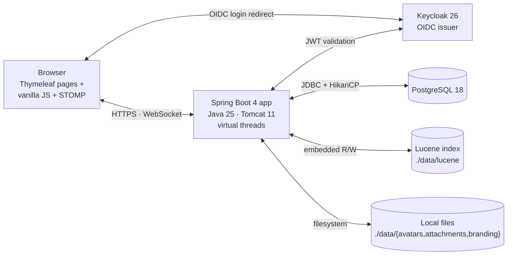
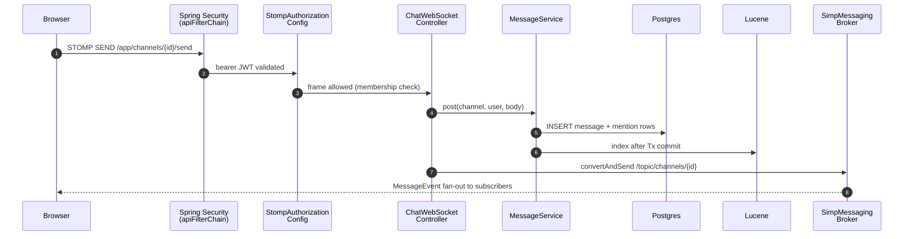
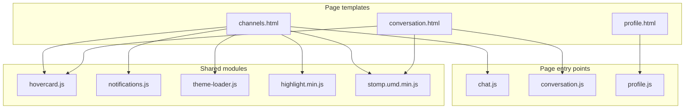

# Radiance — Spring Boot 4 Slack/Mattermost-style chat app

A small workspace chat built with Spring Boot 4, Java 25, PostgreSQL, Keycloak OIDC, STOMP-over-WebSocket, Thymeleaf and vanilla JS.

## Why this exists

This was built by me and Claude in a few hours. I wrote the specification and gave Claude Code free rein on a virtual machine. An application like Slack/Mattermost is actually very simple. Most of the work is plumbing. I trust Claude to get most things right, and will spend time reviewing this code later. But I trust it for now, and we are already running it in production in a local isolated environment. Keep in mind, this is still considered AI-slop, and there are bugs, even serious bugs. But finding these bugs can only be done by either reviewing the code or using the application. Just using it in the current state is a quick way to verify that basic functionality works. Backups also matter. Highly recommend ZFS snapshots every 15 minutes plus a daily `pg_dump`.

Workplace chat is important infrastructure. We should stop handing the keys to a vendor whose interests do not include making sure you can still read your own conversations next year. For me, the ability to self-host isn't a feature — it's a right.

**Slack** is mostly good. The UI is slow, and the product is proprietary, cloud-only, and your archive is governed by the vendor's pricing tiers and retention rules. The cost-per-seat and the visibility horizon are theirs to set. That's a workable trade for plenty of teams. It isn't workable for regulated industries, security-conscious orgs, or anyone who'd rather not have their internal knowledge graph held off-premises.

**Mattermost** sold itself as the open-source Slack alternative, and for a while it was. Then the free edition started taking things back. SAML and OAuth2 logins are paywalled now. Team message history is capped at 10,000 on the free plan. You can still self-host the binary. The open-core playbook is at work here: the things that separate a real chat app from a demo keep migrating into the licence you have to pay for. "Open source" stops meaning much when the table stakes aren't. Mattermost has a very slick and responsive UI, so it's a shame that the company is going open-core for a short-term win.

**Microsoft Teams** is the worst team-collaboration application I've used. Loved by enterprises that hate their employees. I'm always late to MS Teams meetings, because whenever I start it, it has to update and restart and yadda yadda yadda. The UI is so slow that it freezes for seconds.

For me it's important that a chat/team collaboration application is something I can deploy on a box I control. Fast UI. No message cap. No SSO paywall. No telemetry. No vendor able to change the terms a year from now because the funding round demanded it. It won't have Slack's polish or Mattermost's feature breadth. It will still be readable in five years, on a server you own, running code you can audit, under a licence that can't be retroactively narrowed.

## Prerequisites

Before the Quick start you need a Java 25 JDK and (for the container path) Podman. Gradle itself is not required — `./gradlew` downloads it on first use.

### AlmaLinux / Rocky / RHEL 10+

```bash
sudo dnf install -y java-25-openjdk-devel podman podman-compose
java -version    # should report "openjdk 25"
```

### Ubuntu 24.10+ / Debian trixie

```bash
sudo apt install -y openjdk-25-jdk podman podman-compose
java -version
```

On Ubuntu 24.04 LTS or older Debian releases OpenJDK 25 is not in the default archives yet. Either upgrade to a newer release or use sdkman.

### macOS

```bash
brew install openjdk@25 podman
brew services start podman    # or: podman machine init && podman machine start
```

If `java` doesn't end up on `PATH`, follow the post-install instructions Homebrew prints (`echo 'export PATH="/opt/homebrew/opt/openjdk@25/bin:$PATH"' >> ~/.zshrc` on Apple silicon).

## Quick start — development

For exploring the app, hacking on it, or quick local testing. Two commands once the prerequisites above are installed:

```bash
podman compose up -d   # Postgres 18 + Keycloak 26, with the 'chat' realm pre-imported
./gradlew bootRun      # the Spring Boot app on :8080
```

Open http://localhost:8080 and sign in as `alice` / `alice` or `bob` / `bob`. Keycloak admin console is at http://localhost:8081 (`admin` / `admin`).

If `podman compose` can't find a socket, run once: `systemctl --user enable --now podman.socket && export DOCKER_HOST=unix:///run/user/$(id -u)/podman/podman.sock`.

For container-free setup, see [Without containers (native install)](#without-containers-native-install) below.

## Quick start — production

For a real internet-facing deployment. **Do not skip the hardening steps**: the bundled defaults are tuned for local dev and would be embarrassing on the public internet.

```bash
# 1. Build a runnable jar
./gradlew assemble                # produces build/libs/chat-*.jar

# 2. Stand up Postgres 18 + Keycloak 26 on the host (see "Without containers" below)
#    or your managed equivalents. Point the app at them via env vars.

# 3. Configure the production env. Each line below is required.
export RADIANCE_DB_URL=jdbc:postgresql://db.internal:5432/radiance_chat
export RADIANCE_DB_USERNAME=radiance
export RADIANCE_DB_PASSWORD=$(openssl rand -base64 32)
export KEYCLOAK_ISSUER_URI=https://auth.example.com/realms/radiance
export KEYCLOAK_CLIENT_SECRET=$(openssl rand -base64 32)   # rotate from the dev default
export SERVER_ADDRESS=127.0.0.1                            # bind localhost only; nginx fronts it
export RADIANCE_SECURITY_COOKIE_SECURE=true                    # mark JSESSIONID + CSRF cookies Secure

# 4. Run behind a TLS-terminating reverse proxy (see nginx_example.conf in this repo):
java -jar build/libs/chat-*.jar
```

Then complete the [production hardening checklist](#production-hardening-checklist) below before flipping DNS.

## Production: systemd + JVM tuning

The bare `java -jar …` line above gets you running once. For an actual deployment, run under systemd so the OS supervises the process, restarts it on crash, captures logs to `journald`, and applies basic sandboxing.

### systemd unit

Drop this at `/etc/systemd/system/radiance.service`:

Every directive is annotated below — read top to bottom and you'll see exactly what each line buys you. Tested as-is on AlmaLinux 10.1 with SELinux enforcing; `systemd-analyze security` reports an exposure score of **4.7 OK** with this configuration.

```ini
[Unit]
Description=Radiance chat server
Wants=network-online.target
After=network-online.target postgresql.service

[Service]
Type=simple
User=radiance
Group=radiance
WorkingDirectory=/opt/radiance
EnvironmentFile=/etc/radiance/env
# New files default to mode 0750/0640 — no "other" read.
UMask=0027

ExecStart=/usr/lib/jvm/java-25-openjdk/bin/java $JAVA_OPTS -jar /opt/radiance/chat.jar

Restart=on-failure
RestartSec=5s
TimeoutStopSec=30s
KillSignal=SIGTERM

# === Process-level sandbox ============================================
# Block setuid/setgid binaries from elevating privilege if the JVM ever exec's one.
NoNewPrivileges=true
# Block creation of new namespaces (CLONE_NEWUSER / NEWNET / NEWNS …). The JVM doesn't need them.
RestrictNamespaces=true
# Block personality(2) — defence against syscall-table tricks that flip x86_64 to 32-bit.
LockPersonality=true
# Only allow native-arch syscalls. Same idea: no "compat" path for an attacker to ride.
SystemCallArchitectures=native
# Block creation of files with the setuid/setgid bit set.
RestrictSUIDSGID=true
# MemoryDenyWriteExecute is intentionally NOT set — the JIT needs writable + executable
# pages, and the JVM won't start with it on.

# === Filesystem isolation =============================================
# Whole filesystem read-only EXCEPT what ReadWritePaths= explicitly opens up.
# Important caveat: this only blocks WRITES. Reads of world-readable files
# elsewhere on the host are still possible — the InaccessiblePaths= block
# below closes the read leaks that matter.
ProtectSystem=strict
# The only writable location: attachments, avatars, lucene index, heap dumps.
ReadWritePaths=/opt/radiance/data
# /home, /root, /run/user/* become inaccessible (mounted over with empty bind).
ProtectHome=true
# Service gets a private /tmp and /var/tmp. Can't see other services' temp files,
# can't leave files behind that survive the unit.
PrivateTmp=true
# Minimal /dev — /dev/null, /dev/zero, /dev/random, /dev/urandom, /dev/tty.
# No /dev/mem, /dev/sda*, /dev/kmem.
PrivateDevices=true

# === Hide trees the JVM has no business reading =======================
# `open(2)` on any of these returns ENOENT to the service — they literally
# do not exist from the JVM's point of view. Without these directives,
# ProtectSystem=strict only stops writes; everything below is still readable.
# Verified on AlmaLinux 10.1: with this list, /etc/cron.d/*, /var/log/dnf.log,
# /var/log/messages and /var/lib/* are all GONE inside the namespace.
InaccessiblePaths=/var/log /var/spool /var/lib
InaccessiblePaths=/etc/cron.d /etc/cron.daily /etc/cron.hourly /etc/cron.weekly /etc/cron.monthly /etc/crontab /etc/anacrontab
InaccessiblePaths=/etc/sudoers /etc/sudoers.d
InaccessiblePaths=/etc/sssd /etc/pam.d /etc/security
InaccessiblePaths=/etc/rsyslog.d /etc/rsyslog.conf
InaccessiblePaths=/etc/ssh /etc/NetworkManager
# /etc/audit is intentionally NOT in this list — SELinux targeted policy on
# AlmaLinux 10 / RHEL 10 denies init_t the `mounton` permission for
# auditd_etc_t, so adding it makes the unit fail to start. The audit logs
# under /var/log/audit/ are mode 600 anyway, so DAC keeps them out of reach.

# === Kernel surface ===================================================
# Block writes to /proc/sys (sysctl) and most of /sys.
ProtectKernelTunables=true
# Block init_module / finit_module / delete_module — no module load/unload.
ProtectKernelModules=true
# /proc/kmsg and /dev/kmsg become inaccessible. The JVM has no use for the kernel ring buffer.
ProtectKernelLogs=true
# /sys/fs/cgroup is read-only. Service can't escape its own cgroup.
ProtectControlGroups=true
# Block settimeofday(), adjtimex() and friends.
ProtectClock=true
# Block sethostname() and setdomainname().
ProtectHostname=true
# Hide other processes' /proc entries; only this service's PIDs are visible.
ProtectProc=invisible
# /proc shows only PID directories — no /proc/scsi, /proc/sysrq-trigger, /proc/cmdline, …
ProcSubset=pid

# === Network ==========================================================
# Restrict socket(2) families to UNIX + IP. No raw, packet, netlink, bluetooth, can, …
# (The JVM never needs anything else — outbound to Postgres / Keycloak is plain TCP.)
RestrictAddressFamilies=AF_UNIX AF_INET AF_INET6

[Install]
WantedBy=multi-user.target
```

The companion env file at `/etc/radiance/env` (chmod 600, owned by `radiance`):

```bash
# JVM tuning — see the table below for what each flag does.
JAVA_OPTS=-Xms1g -Xmx1g -XX:+ExitOnOutOfMemoryError -XX:+HeapDumpOnOutOfMemoryError -XX:HeapDumpPath=/opt/radiance/data/heapdumps -XX:+UseStringDeduplication -XX:+AlwaysPreTouch -Duser.timezone=UTC

# App config (see "Quick start — production" for the full list)
RADIANCE_DB_URL=jdbc:postgresql://db.internal:5432/radiance_chat
RADIANCE_DB_USERNAME=radiance
RADIANCE_DB_PASSWORD=...
KEYCLOAK_ISSUER_URI=https://auth.example.com/realms/radiance
KEYCLOAK_CLIENT_SECRET=...
SERVER_ADDRESS=127.0.0.1
RADIANCE_SECURITY_COOKIE_SECURE=true
```

Bring it up:

```bash
sudo useradd --system --home /opt/radiance --shell /usr/sbin/nologin radiance
sudo install -d -o radiance -g radiance /opt/radiance /opt/radiance/data /opt/radiance/data/heapdumps
sudo install -d -o root -g radiance -m 750 /etc/radiance
sudo install -m 640 -o root -g radiance /path/to/env /etc/radiance/env
sudo install -m 644 build/libs/chat-*.jar /opt/radiance/chat.jar
sudo chown radiance:radiance /opt/radiance/chat.jar
sudo systemctl daemon-reload
sudo systemctl enable --now radiance
sudo systemctl status radiance
sudo journalctl -u radiance -f
```

### JVM options

Defaults that fail fast and dump enough to debug:

| Flag | Why |
|---|---|
| `-Xms1g -Xmx1g` | Fix the heap. Resizing during a load spike causes a full GC right when you can least afford it. 1 GiB comfortably handles low-thousands of concurrent WebSocket sessions; bump to 2 GiB if you cross ~5k concurrent users or grow a large Lucene index. |
| `-XX:+ExitOnOutOfMemoryError` | Don't limp along with a half-broken VM — let systemd restart instead. |
| `-XX:+HeapDumpOnOutOfMemoryError -XX:HeapDumpPath=…` | A 1 GiB heap dump is small. You'll want it the next time OOM hits. Make sure the path is writable and rotated occasionally. |
| `-XX:+UseStringDeduplication` | G1-only. Collapses duplicate `String` byte arrays — free win on a chat app where the same usernames / channel names appear in every message DTO. |
| `-XX:+AlwaysPreTouch` | Pre-faults every heap page at startup. Adds ~1 s to boot, removes first-allocation jitter at runtime. Worth it for a long-lived server. |
| `-Duser.timezone=UTC` | Container hosts often default to local TZ; pin to UTC so log timestamps line up with your dashboards. |

Things you do **not** need to set:

- `-XX:MaxRAMPercentage` — only useful when running in a container with a cgroup limit and no fixed `-Xmx`.
- `-XX:+UseG1GC` — already the default since Java 9.
- `-XX:+UseCompressedOops` — already on for any heap < 32 GiB.
- `--enable-preview` — Spring Boot 4 doesn't use preview language features here.

The app already enables **virtual threads** via `spring.threads.virtual.enabled=true` in `application.yml`, so your servlet + WebSocket handlers run on Project Loom green threads. That keeps the OS thread count flat regardless of WebSocket fan-out, and shifts the bottleneck from "thread pool exhausted" to "GC throughput" — which leads to the next section.

### What about ZGC / generational ZGC?

G1 is the right default at a 1 GiB heap (10–50 ms pauses, mature, well-understood). **ZGC** and **Shenandoah** trade ~15% RAM and ~10% throughput for sub-millisecond pauses; that's only a win once heap > ~4 GiB **and** GC pauses become user-visible. If you scale up later:

```bash
JAVA_OPTS=-XX:+UseZGC -Xms4g -Xmx4g -XX:+ExitOnOutOfMemoryError -XX:+HeapDumpOnOutOfMemoryError -XX:HeapDumpPath=/opt/radiance/data/heapdumps -Duser.timezone=UTC
```

(Drop `+UseStringDeduplication` and `+AlwaysPreTouch` under ZGC — neither applies.)

### Verifying the namespace lockdown

After `systemctl restart radiance`, three quick checks:

```bash
# Exposure score (target: drops into "OK" range, ~4.7 with the unit above).
sudo systemd-analyze security radiance.service

# From inside the service's mount namespace — these should be Permission denied / ENOENT.
sudo nsenter -t $(systemctl show -p MainPID --value radiance) -m ls /var/log /etc/cron.d

# No SELinux denials.
sudo ausearch -m AVC -ts recent
```

The textbook whitelist alternative (`TemporaryFileSystem=/etc:ro` + `BindReadOnlyPaths=`) **doesn't work on AlmaLinux 10 with SELinux enforcing** — the targeted policy denies `init_t` the `mounton` / `create` rights needed to materialise the bind-mount destinations. Making it work needs a custom policy module; the `InaccessiblePaths=` blacklist above runs with stock policy. If you need a true whitelist, write a custom SELinux domain (see the SELinux section below).

## Production: SELinux on AlmaLinux / RHEL

AlmaLinux 10 (and Rocky / RHEL 10) ships SELinux in **enforcing** mode by default. The systemd unit above runs the JVM in the `unconfined_service_t` domain, so the JIT (writable + executable pages) and the OIDC / JDBC outbound connections work without custom policy. What you do need to set up is **file labels on the data directory** and **one nginx boolean** so the reverse proxy can reach the JVM on `127.0.0.1:8080`.

```bash
# 0. Sanity check — should print "Enforcing".
getenforce

# 1. Make sure the policy management tools are installed (they aren't always pulled in on minimal images).
sudo dnf install -y policycoreutils-python-utils setools-console

# 2. Label /opt/radiance/data so writes survive a relabel (`restorecon -R /` or a touched .autorelabel).
#    var_lib_t is the catch-all label for system services' state directories.
sudo semanage fcontext -a -t var_lib_t '/opt/radiance/data(/.*)?'
sudo restorecon -Rv /opt/radiance

# 3. Allow nginx (httpd_t) to make outbound connections to the JVM on localhost:8080.
sudo setsebool -P httpd_can_network_connect on

# 4. If you bind the JVM to a port that isn't already labelled (8080 is fine; 9090, 8443 etc. are not):
#    sudo semanage port -a -t http_port_t -p tcp 9090
```

The systemd unit's `ReadWritePaths=/opt/radiance/data` and SELinux's file context for the same path are independent layers — both must be correct. The systemd one stops the JVM from writing outside the data dir; the SELinux one stops it from writing inside the data dir if the labels are wrong.

### When something gets denied

The JVM will fail to start, attachments will fail to upload, or nginx will return `502` and there will be **nothing useful** in `journalctl -u radiance` — SELinux denials land in the audit log, not the service log. Check both:

```bash
sudo ausearch -m AVC,USER_AVC -ts recent
sudo journalctl -u radiance -p err --since "10 min ago"
```

Common AVCs and their fixes:

| Symptom | Fix |
|---|---|
| `denied { write } ... path="/opt/radiance/data/..."` | The `restorecon` step was skipped, or the directory was created **after** `semanage fcontext`. Re-run `sudo restorecon -Rv /opt/radiance`. |
| `denied { name_connect } ... port=8080` from `httpd_t` | nginx can't reach the upstream — `sudo setsebool -P httpd_can_network_connect on`. |
| `denied { name_bind } ... port=NNNN` from the JVM | You've bound to a port the policy doesn't recognise as HTTP — `sudo semanage port -a -t http_port_t -p tcp NNNN`. |
| `denied { read } ... path="/etc/radiance/env"` | Custom env file location with the wrong label. Either keep it under `/etc/` (already `etc_t`) or label it: `sudo semanage fcontext -a -t etc_t '/path/to/env'; sudo restorecon -v /path/to/env`. |

### Don't reach for `setenforce 0`

If something breaks, capture the denial and write a targeted local module — don't disable enforcement.

```bash
sudo ausearch -m AVC -ts recent | audit2allow -a -M radiance-local
less radiance-local.te                  # review before loading
sudo semodule -i radiance-local.pp
```

`sudo setenforce 0` is OK as a single-session debug hatch (turn it back on with `setenforce 1`), but never persist permissive across reboots and never edit `/etc/selinux/config` to `SELINUX=disabled` — re-enabling later forces a full relabel.

If you co-locate Postgres on the host, keep `PGDATA` under the default `/var/lib/pgsql/`; moving it elsewhere needs `semanage fcontext -a -t postgresql_db_t '...'`.

## Features

- Sign in with **Keycloak** (OAuth2 / OIDC).
- **Channels** (public + private). Anyone can join public channels; private channels require an admin invite. Channel admins can invite members and promote others.
- **Direct messages** (1:1 and group). DM list lives alongside channels in the sidebar; "Send DM" entry point on every avatar hovercard.
- **Real-time messaging** over native STOMP-over-WebSocket — messages, edits, deletes, and avatar updates fan out live.
- **Threaded replies**, **emoji reactions**, **mentions** (`@username`) with per-channel unread + mention badges, **per-user read state**, **typing indicators**, and **message permalinks**.
- **File attachments** uploaded via streamed multipart (no buffering); image attachments open in a lightbox.
- **Profile pictures** with server-side resize (PNG/JPEG ≤256px), live broadcast on change.
- **Avatar hovercard** with profile info + "Send direct message" action.
- **@mention notifications**: in-tab toast plus opportunistic OS notification (Notification API) when permitted.
- **Markdown** message bodies — server-side render with CommonMark + GFM tables + autolinks, sanitized with jsoup, fenced-code syntax highlighting via highlight.js, and link previews / embedded YouTube.
- **Full-text search** powered by an embedded **Apache Lucene** index. Three scopes: per-channel, across all channels you've joined, and (admin-only) everywhere.
- **Themes** (8 built-in palettes) chosen on the profile page.
- **Admin console** at `/admin` for users with the Keycloak `admin` realm role.

## Stack

### Runtime / build
- **Java 25** toolchain
- **Spring Boot 4.0.5**, Gradle Kotlin DSL
- **PostgreSQL 18** (uses `gen_random_uuid()`)
- **Keycloak 26** as the OIDC issuer (runs out-of-process via `podman compose`)

### Spring Boot starters
| Starter | Brings in |
|---|---|
| `spring-boot-starter-web` | Spring MVC + embedded Tomcat 11, Jackson |
| `spring-boot-starter-websocket` | STOMP-over-WebSocket message broker |
| `spring-boot-starter-thymeleaf` | Thymeleaf 3.1 server-side templates |
| `spring-boot-starter-data-jpa` | Spring Data JPA + Hibernate ORM 7 |
| `spring-boot-starter-security` | Core Spring Security (filter chains, CSRF, headers) |
| `spring-boot-starter-oauth2-client` | OIDC login flow against Keycloak |
| `spring-boot-starter-oauth2-resource-server` | Bearer-JWT validation on `/api/**` and `/ws/**` |
| `spring-boot-starter-validation` | Hibernate Validator 9 for `@Valid` request bodies |
| `spring-boot-starter-actuator` | Health + metrics endpoints |
| `spring-boot-flyway` + `flyway-core` + `flyway-database-postgresql` | Schema migrations (`db/migration/V*.sql`) |

### Auxiliary Spring pieces
- `spring-security-messaging` — STOMP-frame authorization (`StompAuthorizationConfig`)
- `thymeleaf-extras-springsecurity6` — `sec:authorize` attributes in templates

### Storage
- **Hibernate ORM 7.2** (transitive via Spring Data JPA), `ddl-auto=validate`
- **PostgreSQL JDBC 42.7** (runtime only)
- **HikariCP** connection pool (Spring Boot default)
- **Flyway 11** migrations

### Domain libraries
- **CommonMark 0.22** + GFM-tables and autolink extensions — server-side Markdown rendering (`MarkdownRenderer`)
- **jsoup 1.18** — HTML sanitization with a tightened `Safelist.basic` after Markdown render
- **Apache Lucene 10.4** (`core`, `analysis-common`, `queryparser`) — embedded full-text index at `./data/lucene` (`MessageIndexService`); writes are flushed after the surrounding JPA transaction commits. No Postgres `tsvector`, no ILIKE.
- **Apache Commons FileUpload 2.0** (`jakarta-servlet6` variant) — streaming multipart parser used for avatar / attachment uploads, bypasses Spring's buffering `MultipartResolver`

### Frontend
- Thymeleaf templates + hand-written vanilla JS (no React/Vue/Svelte, no npm bundler)
- Vendored under `static/js/vendor/`: **StompJS** (WebSocket STOMP client) and **highlight.js** (code-block syntax highlighting)
- STOMP rides on **native WebSocket only** — no SockJS fallback (its inline-script transports break the strict CSP)

### Test stack
- **JUnit 5** (Jupiter) via `spring-boot-starter-test`
- **AssertJ**, **Mockito** (transitive)
- `spring-security-test` for security helpers
- **Testcontainers BOM 1.20.4** (`postgresql` + `junit-jupiter`) — real Postgres 18 per IT class (no H2)
- `spring-boot-testcontainers` for `@ServiceConnection` wiring

### Code generation
- **Lombok 1.18.38** — `@Getter` / `@Setter` / `@NoArgsConstructor(access = PROTECTED)` on JPA entities only. DTOs stay as records (records cover the immutable-data-class case the language already gives us). Side-effecting setters (`setBodyMarkdown` bumps `editedAt`, `setAvatar` bumps `avatarUpdatedAt`, `pin/unpin`, `markRead`) are written by hand — Lombok skips generation when a same-signature method already exists.

### Notably absent (intentional)
- No MapStruct (manual `from(...)` factory methods on DTOs instead — keeps the mapping visible)
- No reactive stack (no WebFlux, R2DBC)
- No Spring Cloud, no external message broker beyond the in-memory STOMP broker
- No H2 / HSQLDB — production schema uses features H2 won't accept

## Architecture

### Deployment overview

One JVM, three external dependencies (Keycloak, Postgres, a local data directory). Lucene is embedded; STOMP runs against Spring's in-memory `SimpleBrokerMessageHandler`, no Redis or RabbitMQ.



### Backend request lifecycle

What happens when the browser sends a chat message over STOMP:



Two `SecurityFilterChain` beans split the auth posture: `apiFilterChain` (order 1) handles `/api/**` and `/ws/**` with stateless bearer JWT (no CSRF). `webFilterChain` (order 2) handles browser page loads with stateful OIDC session and CSRF cookies. `StompAuthorizationConfig` is a separate `ChannelInterceptor` that enforces channel/conversation membership on every `SUBSCRIBE` frame.

### Frontend module composition

Each page is a Thymeleaf template that pulls in a single page-specific entry-point JS file (wrapped in an IIFE — nothing leaks to `window`). Shared modules are loaded only by the pages that need them:



Cross-module calls go through tiny `window.*` surfaces only where needed (e.g. `window.MentionNotifications.show(...)` so `chat.js` can fire a toast without importing `notifications.js` directly).

## Run locally

### With Podman compose (recommended)

The container runtime here is **Podman** (Docker is not installed in our dev env). The Quick start above covers the happy path; here are the details if you need them.

```bash
systemctl --user enable --now podman.socket
export DOCKER_HOST=unix:///run/user/$(id -u)/podman/podman.sock

podman compose up -d            # or `podman-compose up -d`
./gradlew bootRun
```

`podman compose up -d` reads `docker-compose.yml`, starts a `postgres:18-alpine` container with the `chat`/`chat`/`chat` (db/user/password) defaults, and a `keycloak:26.0` container that imports `keycloak/realm.json` on first start.

If `gradlew` is missing (fresh checkout into a tree where the wrapper isn't committed), run once: `gradle wrapper --gradle-version 9.0.0`.

### Without containers (native install)

If you'd rather run Postgres and Keycloak directly on the host (production deploy, air-gapped server, no container runtime), here's the path.

#### PostgreSQL 18

**RHEL / Fedora / Rocky:**
```bash
sudo dnf install -y postgresql18-server postgresql18
sudo /usr/pgsql-18/bin/postgresql-18-setup initdb
sudo systemctl enable --now postgresql-18
```

**Debian / Ubuntu:**
```bash
sudo apt install -y postgresql-18
sudo systemctl enable --now postgresql
```

**macOS (Homebrew):**
```bash
brew install postgresql@18
brew services start postgresql@18
```

Create the database and role:

```bash
sudo -u postgres psql <<'SQL'
CREATE USER chat WITH PASSWORD 'chat';
CREATE DATABASE chat OWNER chat;
GRANT ALL PRIVILEGES ON DATABASE chat TO chat;
SQL
```

That's all the SQL setup you need. Flyway runs the schema migrations on first app start (V1 → V13).

#### Keycloak 26

Keycloak needs Java 21+ — your Java 25 install is fine. Download a release and run it directly:

```bash
KC_VERSION=26.0.5
curl -L https://github.com/keycloak/keycloak/releases/download/${KC_VERSION}/keycloak-${KC_VERSION}.tar.gz | tar -xz
cd keycloak-${KC_VERSION}

# Drop the realm definition where Keycloak picks it up on import:
mkdir -p data/import
cp /path/to/this-repo/keycloak/realm.json data/import/

# Initial admin (set once before first start):
export KC_BOOTSTRAP_ADMIN_USERNAME=admin
export KC_BOOTSTRAP_ADMIN_PASSWORD=admin

bin/kc.sh start-dev --import-realm --http-port=8081
```

`start-dev` runs against an embedded H2 — fine for a quick local run. For production, switch to `bin/kc.sh start` and configure a Postgres backend (a separate database from the chat one) per Keycloak's docs.

Once Keycloak is up at http://localhost:8081 the `chat` realm exists with users `alice` / `alice` and `bob` / `bob`. Point the chat app at it:

```bash
export KEYCLOAK_ISSUER_URI=http://localhost:8081/realms/radiance
export KEYCLOAK_CLIENT_SECRET=<value from realm.json or a fresh one you rotated to>
./gradlew bootRun
```

## Keycloak realm

The bundled `keycloak/realm.json` defines everything `podman compose` and `kc.sh start-dev --import-realm` pick up. If you build a realm from scratch in the admin UI, match the settings below.

### Realm + client

| Item | Value |
|---|---|
| Realm name | `chat` |
| Login with email | enabled |
| Self-registration | enabled |
| Client id | `chat` (confidential, Authorization Code + PKCE) |
| Client secret | `(generated; rotate)` (override via `KEYCLOAK_CLIENT_SECRET` in production) |
| Valid redirect URIs | `http://localhost:8080/*`, `http://192.168.100.98:8080/*` |
| Web origins | `http://localhost:8080`, `http://192.168.100.98:8080` |

If you move the app to a different host or port, update both Valid redirect URIs and Web Origins to match. A mismatch shows up as `400 invalid_redirect_uri` from Keycloak after sign-in.

### Roles

Three realm roles ship in the bundled config:

| Role | Purpose | Granted to |
|---|---|---|
| `user` | Marker assigned to every regular account. Not consumed by the chat app itself; handy for filtering in Keycloak. | alice, bob; assign as default to self-registered accounts |
| `admin` | Keycloak's built-in realm admin. **Intentionally ignored** by the chat app. | (Keycloak internal) |
| `chat-admin` | Application admin. Required for `/admin` and cross-channel search. Maps to Spring's `ROLE_ADMIN` in `KeycloakRolesConverter`. | alice (in the bundled realm) |

The split is deliberate: the person who admins your Keycloak instance is not automatically a chat administrator. Promote individual users to `chat-admin` via **Users → pick user → Role mappings → Assign role**.

### Enabling user registration

Self-registration is already on in the bundled realm. To toggle (or enable on a hand-built realm):

1. Open the Keycloak admin console at http://localhost:8081 (default `admin` / `admin`).
2. Switch to the **chat** realm in the top-left dropdown.
3. **Realm settings → Login** tab.
4. Toggle **User registration** on.
5. (Optional) **Forgot password** to expose a self-service reset link on the login page.
6. (Optional) **Verify email** to require confirmation before first login. Needs SMTP configured under **Realm settings → Email**.

Then make sure new self-registered accounts get the `user` realm role automatically:

1. **Realm settings → User registration** sub-tab (or **Realm roles → default-roles-chat**).
2. Assign realm role `user` (and any others you want every account to have).

`chat-admin` is deliberately **not** in the default role set and should never be — promote people one at a time, after you've vetted them.

## Configuration

Every override is plain Spring Boot env-var substitution against `application.yml` — no profiles, no surprises. A [Vault / OpenBao secret backend](#optional-vault--openbao-secret-backend) is available as an opt-in for production; off by default so the env-var path Just Works.

| Variable | Default | Purpose |
|---|---|---|
| `RADIANCE_DB_URL` | `jdbc:postgresql://localhost:5432/radiance_chat` | JDBC URL for the Postgres instance |
| `RADIANCE_DB_USERNAME` | `radiance` | Postgres user |
| `RADIANCE_DB_PASSWORD` | `radiance` — **rotate in production** | Postgres password — **set this in production** |
| `KEYCLOAK_ISSUER_URI` | `http://192.168.100.98:8081/realms/radiance` | Keycloak realm issuer (used by both OIDC client and resource server) |
| `KEYCLOAK_CLIENT_ID` | `radiance` | OIDC client id |
| `KEYCLOAK_CLIENT_SECRET` | `(generated; rotate in production)` | OIDC client secret — **set this in production** |
| `SERVER_PORT` | `8080` | HTTP port the Boot app binds to |
| `SERVER_ADDRESS` | `192.168.100.98` | Network interface to bind (`0.0.0.0` to listen on all) |
| `RADIANCE_ATTACHMENTS_DIR` | `./data/attachments` | Where uploaded message attachments are stored |
| `RADIANCE_AVATARS_DIR` | `./data/avatars` | Where uploaded avatars are stored |
| `RADIANCE_BRANDING_DIR` | `./data/branding` | Where the admin-uploaded logo is stored |
| `RADIANCE_SECURITY_COOKIE_SECURE` | `false` | Mark JSESSIONID + CSRF cookies `Secure`. Set to `true` when serving over HTTPS. |

The Lucene index lives at `./data/lucene` (override with `chat.search.lucene-dir`). Back up the whole `./data/` directory plus the Postgres database and you have everything: messages, attachments, avatars, branding, and the search index.

### Optional: Vault / OpenBao secret backend

For deployments where shipping `RADIANCE_DB_PASSWORD` and `KEYCLOAK_CLIENT_SECRET` via `EnvironmentFile=` is too coarse, the app can pull them from a [HashiCorp Vault](https://www.vaultproject.io/) / [OpenBao](https://openbao.org/) KV-v2 mount at boot. **Off by default** — `RADIANCE_VAULT_ENABLED=false` skips the integration entirely.

When enabled, a `VaultEnvironmentPostProcessor` runs before Spring autoconfiguration reads `spring.datasource.*` / the OAuth client config, fetches one KV-v2 record, and injects the values as a high-priority `MapPropertySource`.

| Variable | Default | Purpose |
|---|---|---|
| `RADIANCE_VAULT_ENABLED` | `false` | Master switch. |
| `RADIANCE_VAULT_URI` | _(empty)_ | Base URL (e.g. `http://127.0.0.1:8200`). Required when enabled. |
| `RADIANCE_VAULT_TOKEN` | _(empty)_ | Token credential. Required when enabled. |
| `RADIANCE_VAULT_PATH` | `radiance` | KV-v2 path; default maps to `secret/data/radiance`. |

If enabled but URI or token is missing, the app **fails fast at boot** with `IllegalStateException` — silently falling back to env-var defaults in a "vault-enabled" deploy would be a security bug.

**Vault record schema** (five keys, anything else ignored):

| Vault key | Spring property |
|---|---|
| `db.username` | `spring.datasource.username` |
| `db.password` | `spring.datasource.password` |
| `keycloak.client-id` | `spring.security.oauth2.client.registration.keycloak.client-id` |
| `keycloak.client-secret` | `spring.security.oauth2.client.registration.keycloak.client-secret` |
| `keycloak.issuer-uri` | mirrored into both `spring.security.oauth2.client.provider.keycloak.issuer-uri` and `spring.security.oauth2.resourceserver.jwt.issuer-uri` (the OIDC client and the resource server read different slots) |

**Try it locally** — the bundled `docker-compose.yml` has a profile-gated OpenBao dev container:

```bash
podman compose --profile openbao up -d
KEYCLOAK_CLIENT_SECRET=<value-from-keycloak/realm.json> ./scripts/seed-vault.sh
RADIANCE_VAULT_ENABLED=true RADIANCE_VAULT_URI=http://127.0.0.1:8200 \
  RADIANCE_VAULT_TOKEN=radiance-dev-token ./gradlew bootRun
```

Hit `/actuator/env` to verify the `radiance-vault` property source appeared. The OpenBao dev container uses in-memory storage and a root token — for production, switch to sealed deployment + auto-unseal + AppRole or Kubernetes auth.

### Upload size cap

Default cap is **50 MiB per upload**. The cap applies per user; admins (anyone with the `chat-admin` realm role) get unlimited.

To grant a non-admin a higher (or lower) cap:

1. Open the Keycloak admin console → **chat** realm → **Users** → pick the user.
2. **Attributes** tab → add an attribute named `chat_max_upload_bytes` with a positive byte count (e.g., `524288000` for 500 MiB), or `-1` for unlimited.
3. Save. The user's next login picks up the new value via the JWT claim mapper that ships in `keycloak/realm.json`.

Avatars have a separate, hard 5 MiB cap (they're decoded into memory for resize, so the cap is structural rather than configurable). Both endpoints stream chunk-by-chunk via Apache Commons FileUpload so the bytes are never fully buffered.

Server-side errors are returned as `413 Payload Too Large` with `{ code: "upload_too_large", maxBytes: <bytes> }`; the JS upload UX in `chat.js` / `conversation.js` / `profile.js` renders that as "File too large — your account is capped at N MiB per upload."

### Session timeout

Inactive users are signed out after **8 hours** of no input by default. The browser watches for `mousemove` / `keydown` / `scroll` / `touchstart` / `focus` events and fires `POST /logout` once the threshold is hit; Spring's HTTP session and Keycloak's SSO session both expire on the same 8h schedule, so a tab left open quietly drops on every layer.

The authoritative knob is **Keycloak**, not the chat app. To change the timeout:

1. Open the Keycloak admin console → **chat** realm → **Realm settings → Sessions** tab.
2. Set **SSO Session Idle** (and optionally **SSO Session Max** for a hard ceiling) to your preferred duration.
3. Bump `server.servlet.session.timeout` in `application.yml` (or set `SERVER_SERVLET_SESSION_TIMEOUT` as an env var) to match — otherwise Spring's web session may expire before Keycloak's.
4. Update the `IDLE_TIMEOUT_MS` constant at the top of `static/js/idle-logout.js` if you want the proactive client-side logout to align too.

For production, also: terminate TLS in front of the JVM (Caddy / Nginx / a managed LB), front Keycloak with TLS too, and review `security_plan.md` for the full hardening checklist.

### Admin email visibility

The admin console at `/admin` lists every user in the workspace, and by default that list **shows full email addresses**. This matters because:

- Most small teams use the column to find a colleague's email — it's useful and the same admins can look it up directly in Keycloak anyway.
- A screenshot of the admin page, or a stolen browser session, exposes every user's email at once. For a workspace under privacy-sensitive policies (HIPAA, GDPR-strict, customer-facing forums), that's a leak.

There's a per-deployment toggle for this. **Default: on (raw emails visible)** to preserve the existing behaviour for installs upgrading from before the toggle existed. To flip it off:

1. Sign in as an admin (Keycloak `chat-admin` realm role) and open `/admin`.
2. Find the **Privacy** section (right above the Users table).
3. Uncheck **Show full emails on this page** and click **Save privacy setting**.

When off, each row is rendered server-side as `al…@example.com` (first two letters of the local part, then `…`, then the full domain). The DB still stores the raw value — only the rendering is masked, so flipping the toggle back on doesn't lose anything.

The setting persists in `app_settings.expose_user_emails` (V20 migration). It applies only to the admin page; mention rendering, hovercards, and the user profile API don't expose email at all (and never have).

### Production hardening checklist

The systemd / SELinux / Quick start sections cover the mechanical setup. This is the punch-list of things the earlier sections don't enforce on your behalf.

| | What | Why |
|---|---|---|
| ☐ | Rotate `KEYCLOAK_CLIENT_SECRET` (Keycloak admin → **Clients → radiance → Credentials → Regenerate**) | The bundled secret in `keycloak/realm.json` is in this public repo. |
| ☐ | Restrict the `chat` client's **Valid redirect URIs** + **Web origins** to your real hostname | OIDC redirect-URI matching is your defence against open-redirect token theft. |
| ☐ | Change `KC_BOOTSTRAP_ADMIN_PASSWORD` from `admin` | Master key to every account in your realm. |
| ☐ | Enable **Verify email** in Keycloak before opening self-registration | Without it, bots will mass-register. |
| ☐ | Configure SMTP under Realm settings → Email | Otherwise password reset and email verification silently no-op. |
| ☐ | Set `client_max_body_size` in nginx | Edge ceiling above the app's per-user 50 MiB cap. |
| ☐ | Schedule Postgres + `./data/` backups; verify restores work | The whole product fits in `pg_dump` + that directory. |
| ☐ | Enable CVE scanning in CI (OWASP `dependency-check`, Dependabot, etc.) | Hibernate / Tomcat / Jackson ship CVEs over any deploy's lifetime. |
| ☐ | Replace the in-memory `RateLimiter` before scaling past one replica | Per-process limits don't compose across N replicas. |

`security_plan.md` has the full per-finding rationale; `SecurityBoundaryIT` and `InternetExposureSecurityIT` pin the invariants.

## Tests

The suite is **190+ tests across 21 classes** — about 30 unit tests that run anywhere, and ~160 integration tests that need a Postgres container. Both layers run from a single `./gradlew test`.

### Run everything

```bash
# One-time: expose the Podman user socket so Testcontainers can find a Docker-compatible API
systemctl --user enable --now podman.socket
export DOCKER_HOST=unix:///run/user/$(id -u)/podman/podman.sock

./gradlew test                    # full suite (unit + integration)
```

The first run pulls `postgres:18-alpine` (~80 MB); subsequent runs reuse the cached image and finish in 1–2 minutes on a laptop. Reports land at `build/reports/tests/test/index.html` (HTML) and `build/test-results/test/TEST-*.xml` (JUnit XML for CI).

### Run a subset

```bash
# Unit tests only — no Docker needed.
./gradlew test --tests 'ai.intellistream.radiance.service.*' --tests 'ai.intellistream.radiance.security.*'

# Single class / method.
./gradlew test --tests 'ai.intellistream.radiance.integration.HovercardAndDmFlowIT'
./gradlew test --tests 'ai.intellistream.radiance.integration.SearchFlowIT.fuzzyMatch_*'
```

### Test layers

- **Unit** (`src/test/java/.../service/`, `.../security/`) — pure-logic branches: Markdown rendering + sanitization, slug rules, search input validation, role conversion. No Docker.
- **Integration** (`src/test/java/.../integration/`) — `IntegrationTestApplication` boots a slimmed Spring context (no security / OAuth2 / web autoconfig) against Testcontainers Postgres and exercises the service layer end-to-end. Each IT class registers its own `chat.search.lucene-dir` via `TestLuceneDirs.register(...)` so cached Spring contexts don't fight over the Lucene lock.
- **Controller-shaped ITs** (`AvatarBroadcastIT`, `HovercardAndDmFlowIT`, `MentionBroadcastIT`) wire a controller manually with mocked `CurrentUser` / `SimpMessagingTemplate` to assert broadcast wiring without a full web layer.
- **Security boundary ITs** (`SecurityBoundaryIT`, `InternetExposureSecurityIT`) pin the auth/authz invariants — see `security_plan.md`.

### Constraints worth knowing

- **No H2 fallback.** Hibernate runs in `validate` mode against the production schema; H2 won't accept some of the column types it uses.
- **Per-class Postgres container.** Each `@Container` spins up a fresh database (~21 transient containers for the full suite).
- **Stale daemon env.** Gradle's daemon caches `DOCKER_HOST` from when it started — `./gradlew --stop` if you change the export.
- **Lucene lock.** "Failed to open Lucene index at …" usually means a stale lock — clear `build/test-lucene/` and rerun.

## Layout

```
src/main/java/ai/intellistream/radiance/
├── ChatApplication.java
├── config/        # SecurityConfig (two filter chains), WebSocketConfig, StompAuthorizationConfig, MultipartConfig
├── domain/        # JPA entities (User, Channel, Message, Conversation, Attachment, Reaction, Mention, ...)
├── repository/    # Spring Data JPA repos
├── search/        # Embedded Lucene index service + bootstrap rebuild
├── service/       # ChannelService, MessageService, ConversationService, AvatarService, AttachmentService,
│                  # ReactionService, ReadStateService, MentionService, MarkdownRenderer, SidebarService, ...
├── security/      # CurrentUser, KeycloakRolesConverter, RateLimiter, RateLimitExceededException
└── web/           # REST + MVC controllers, STOMP controllers, ApiExceptionHandler, dto/

src/main/resources/
├── application.yml
├── db/migration/V1__…V13__…sql        # Flyway migrations (channels → DMs → attachments → reactions → ...)
├── templates/                          # landing, channels, conversation, profile, admin
└── static/
    ├── css/app.css
    └── js/                             # chat, conversation, hovercard, notifications, profile,
                                        # theme-loader, emoji-data + vendor/{stomp,highlight}
```

## Roadmap (still open)

- Highlighted snippets in search results.
- Permission UI for promoting/demoting channel admins (the service supports it; no UI wired yet).
- E2E test with a real Keycloak (Testcontainers Keycloak module).
- Distributed rate limiting (`RateLimiter` is per-process; replace with Bucket4j-with-Hazelcast or Redis before going multi-instance).
- OWASP `dependency-check` Gradle plugin for CVE scanning.
- Broader MIME sniffing on upload — currently `URLConnection.guessContentTypeFromStream`; swap in Apache Tika for wider coverage.

## License

Apache License 2.0. See [`LICENSE`](LICENSE) for the full text. Every source file carries the standard Apache header — fork it, run it, change it, ship it. The licence cannot be retroactively narrowed; that's the point.
